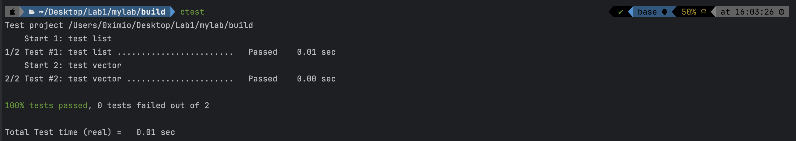

### My STL Report

有一说一，这个STL Lab的质量还是很高的，但是不参考一些代码似乎很难完成。
涉及到一些较难的知识点有**rValue**、**Moving Semantics**、**Initialization List**、**const_cast**和**static_cast**等等C++高级特性。

与此同时，对于**std::construct**、**std::make_reverse_iterator**、**std::destroy_at**、**Allocator**这些都是没见过的东西，还需要好好的研究一下都有哪些函数，用来做什么和参数分别是什么。

感觉最难的应该是list的这两个inline函数：
这两个inline函数（有无const版）是从基类**ListBaseNode<T>**获取派生类**ListValueNode<T>**的成员变量m_value的引用，利用**static_cast**进行转换。

**\*this** 是 ListValueNode<T> 类型对象。

```c++
template<class T>
inline T &ListBaseNode<T>::value() {
    return static_cast<ListValueNode<T> &>(*this).m_value;
}

template<class T>
inline T const &ListBaseNode<T>::value() const {
    return static_cast<ListValueNode<T> const &>(*this).m_value;
}
```

最后附上成功通过的截图：
