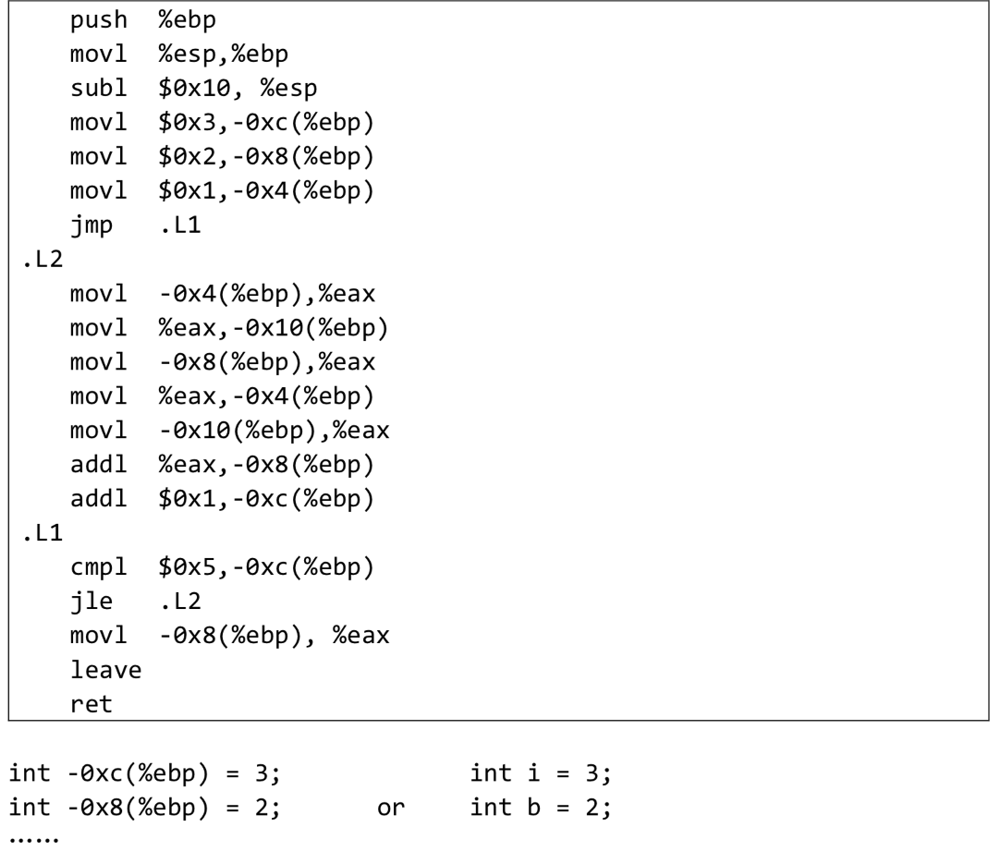

## Homework5 2023202300 张昕跃

---

### Q1(1)

##### Assume we have following address binding table and value of registers :

| Address | Value | Register | Value |
| ------- | ----- | -------- | ----- |
| 0x100   | 0x10  | %eax     | 0x10  |
| 0x110   | 0x11  | %ebx     | 0x100 |
| 0x120   | 0x12  |          |       |
| ...     | ...   | ...      | ...   |
| 0x190   | 0x19  |          |       |
| 0x200   | 0x20  |          |       |

#### Answer1(1)

##### Please fill in the table below

| Operand         | Value |
| --------------- | ----- |
| %ebx            | 0x100 |
| $0x150          | 0x150 |
| 0x170           | 0x17  |
| (%ebx)          | 0x10  |
| (%ebx,%eax)     | 0x11  |
| 0x30(%ebx)      | 0x13  |
| 80(%ebx,%eax,2) | 0x17  |

1. 寄存器取值（例如%eax、%ebx）
2. 立即数取值（$+数字）
3. 地址取值 （0x170 地址中的值应该是 0x17）
4. 寄存器+内存，（）中是内存地址，同时被寄存器存储
5. %ebx + %eax 的值，即 0x110 中的值
6. 立即数+内存+寄存器，0x30 是偏移地址，因此是 0x130 存储的值
7. 80 + %ebx + 2\*%eax 存储的值，也就是 0x170 中的值

### Q1(2)

##### Suppose registers and bound values will be reset as above after each instruction. Please fill in the table below: (Write all if there are more than one destinations and None if there is no destination)

#### Answer1(2)

| Instruction           | Destination | Value      |
| --------------------- | ----------- | ---------- |
| addl %eax,%ebx        | %ebx        | 0x110      |
| subl %eax,(%ebx)      | 0x100       | 0x0        |
| leal 0x50(%eax), %edx | %edx        | 0x60       |
| movzbl %al, %ebx      | %ebx        | 0x00000010 |
| movsbl %bh, %ecx      | %ecx        | 0x00000001 |

1. 把%eax 中的值加到%ebx 中去
2. 把%eba 寄存器中的值取出来作为内存地址，将内存地址对应的值减掉%eax 寄存器中的值
3. leal 是将地址加载到寄存器中，这里就是将%ebx 中的值+0x50 传到%edx 中
4. movzbl 负责拷贝一个字节（%al 寄存器，%eax 的低八位），并用 0 填充其目的操作数中的其余各位，完成“零扩拓展”，拓展为四个字节（%ebx 是 32 位寄存器）
5. movsbl 和 movzbl 类似，不过是完成“符号拓展”，操作%ebx 的高八位复制到%ecx 中去

### Q1(3)

##### Assume the initial value of the flags is 0. Fill the table below

#### Answer1(3)

| Instruction     | OF  | SF  | ZF  | CF  |
| --------------- | --- | --- | --- | --- |
| leal(%eax),%ebx | 0   | 0   | 0   | 0   |
| subl %ebx, %eax | 0   | 1   | 0   | 1   |
| xorl %eax, %eax | 0   | 0   | 1   | 0   |
| test %eax, %ebx | 0   | 0   | 1   | 0   |

- OF(Overflow Flag)
- SF(Sign Flag)
- ZF(Zero Flag)
- CF(Carry Flag)

1. 将(%eax)中的有效地址(这里就是寄存器中的值 0x10)加载到%ebx，不会改变符号位，产生进位等等
2. 将%eax 中的值减去%ebx 中的值，也就是 0x10-0x100，会影响符号位 SF，借位也会影响 CF
3. 将%eax 寄存器中的值与其本身异或，结果为 0，影响 ZF
4. test 是按位与操作，也就是 0x10&0x100，结果也为 0，影响 ZF

补充：

1. 如果乘法结果溢出（即高位寄存器非零，如 8 位乘法超出 AL 并需要 AH 存储结果），CF 会被置为 1；否则为 0。
2. XOR 会使得 CF 和 OF 都为 0；
3. 移位的时候，CF 会被置成最后一个移出的位；
4. 当被减数小于减数（借位的时候）CF 会被置成 1，当然加法溢出也会；
5. 自增自减符号不改变 CF；

### Q2

- Translate the following assembly into C codes.
- You can name local variables represented by -12(%ebp), -8(%ebp)...or a,b,c... freely as you like.
- The beginning of C codes is given.



#### Answer2

```c
  // 寄存器写法
  int -0xc(%ebp) = 3; // movl $0x3,-0xc(%ebp) / int i = 3
  int -0x8(%ebp) = 2; // movl $0x2,-0x8(%ebp) / int b = 2
  int -0x4(%ebp) = 1; // movl $0x1,-0x4(%ebp)
  // 随后跳转到 .L1
  // cmpl $0x5,-0xc(%ebp) 检查 -0xc(%ebp) 是否为(<=) 5
  // 如果满足，跳转到 .L2
  while( -0xc(%ebp) <= 5)
  {
    int %eax = -Ox4(%ebp);         // movl -Ox4(%ebp), %eax
    int -0x10(%ebp) = -Ox4(%ebp);  // movl %eax, -0x10(%ebp)
    %eax = -0x8(%ebp);             // movl -0x8(%ebp), %eax
    -0x4(%ebp) = -0x8(%ebp);       // movl %eax, -Ox4(%ebp)
    %eax= -0x10(%ebp);             // movl -Ox10(%ebp), %eax
    -0x8(%ebp) += -0x10(%ebp);     // addl %eax, -0x8(%ebp)
    -0xc(%ebp)++;                  // addl $0x1, -Oxc(%ebp)
  }

  %eax = -0x8(%ebp);               // movl -0x8(%ebp), %eax
  return %eax;
```

```c
  // 变量写法
  int i = 3;
  int b = 2;
  int c = 1;

  while(i<=5){
    int temp = c;
    c = b;
    b += temp;
    i++;
  }

  return b;
```
