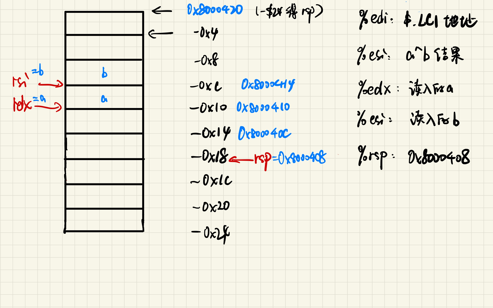

## Homework7 2023202300 张昕跃
------------------------------
### Q1
##### 一个C函数fun具有如下代码体：(参数从右向左入栈)
``` c
*p = d;
return x-c;
```
##### 执行这个函数体的IA32代码如下：
```nasm
Movsbl	12(%ebp), %edx // 较小的byte->dword, s表示符号填充，z表示0填充
Movl	16(%ebp), %eax
Movl 	%edx, (%eax)
Movswl	8(%ebp), %eax
Movl	20(%ebp), %edx
Subl	%eax, %edx
Movl	%edx, %eax
```
##### 写出函数fun的原型，给出参数p, d, x, c的类型和顺序。写出求解过程。

#### Answer1
**movsbl**获取4字节数据，且做符号拓展，因此**12(%ebp)**应该是一个**signed char**。由第三行访问内存可以得到，**16(%ebp)**是**指针p**，且应该对应**32位**。
**movswl**获取8字节数据并做符号拓展，因此**8(%ebp)**是一个**signed short**。倒数第二行做了减法可以得到，**20(%ebp)**对应x，是一个32位数字。

做了符号拓展可以判断是否为有符号数，而只是加减法无法判断。

上述分析可以得到(**这里只对对应字节取一种数据，未作多解分析**)：
- p -> signed/~~unsigned~~ int * -> 16(%ebp)
- d -> signed char -> 12(%ebp)
- x -> signed/~~unsigned~~ int -> 20(%ebp)
- c -> signed short -> 8(%ebp)
- 由于栈从上往下地址减小，小地址对应第一个参数，所以参数顺序是**c、d、p、x**


### Q2
- Suppose the initial value of %esp is 0x7FFFFFC4, initial value of %ebp is 0x7FFFFFF4.
- The value stored in address 0x7FFFFFC0 is 0x120, value stored in address 0x7FFFFFC4 is 0x200, the value stored in address 0x7FFFFFF4 is 0x2710. 
- We have following x86 assembly code executed sequentially: 
``` nasm
pushl %ebp (instruction 1)
movl %esp,%ebp (instruction 2)
popl %ebp (instruction 3) 
```
##### Question: After each instruction executed, what is the value of %esp and %ebp 

#### Answer2
(1) Instruction 1:
- %esp = 0x7FFFFFC0
- %ebp = 0x7FFFFFF4
将 **%esp** **pushl**的时候会将esp指针本身-4，并在此处写入**pushl**后面的地址，也就是 **%ebp** 的地址(写在了0x7FFFFFC0)，而这步操作不影响 **%ebp**
(2) Instruction 2:
- %esp = 0x7FFFFFC0
- %ebp = 0x7FFFFFC0
这步操作将现在 **%esp** 的值赋值给 **%ebp**，而 **%esp** 本身应该保持不变。
(3) Instruction 3: 
- %esp = 0x7FFFFFC4
- %ebp = 0x7FFFFFF4
popl命令是弹出目前栈顶的4字节（**也就是%esp指向的地址，此时指向0x7fffffC0，里面存的是0x7FFFFFF4**）并且存入 **%ebp**，而 **%esp** 也要同时+4。

### Q3
##### 右边是C语言源代码文件func.c对应的汇编代码，请写出对应的C语言代码；
- 画出Line 24执行前栈的状态，以及此时寄存器%edi, %esi, %edx, %ecx, %rsp的值；
- 假设进入main函数前%rsp的值为0x8000420（代码中出现的局部变量，要标记在栈图中；图中标记内存地址）
``` nasm
.file   "func.c"
.LC0:
    .string "%d %d"
.LC1:
    .string "%d %d %d\n"

main:
    subq    $24, %rsp
    leaq    8(%rsp), %rdx
    leaq    12(%rsp), %rsi
    movl    $.LC0, %edi
    movl    $0, %eax
    call    __isoc99_scanf
    movl    12(%rsp), %ecx
    movl    8(%rsp), %edx
    movl    %edx, %esi
    xorl    %ecx, %esi
    movl    $.LC1, %edi
    movl    $0, %eax
    call    printf
    movl    $0, %eax
    addq    $24, %rsp
    ret
```

#### Answer3
