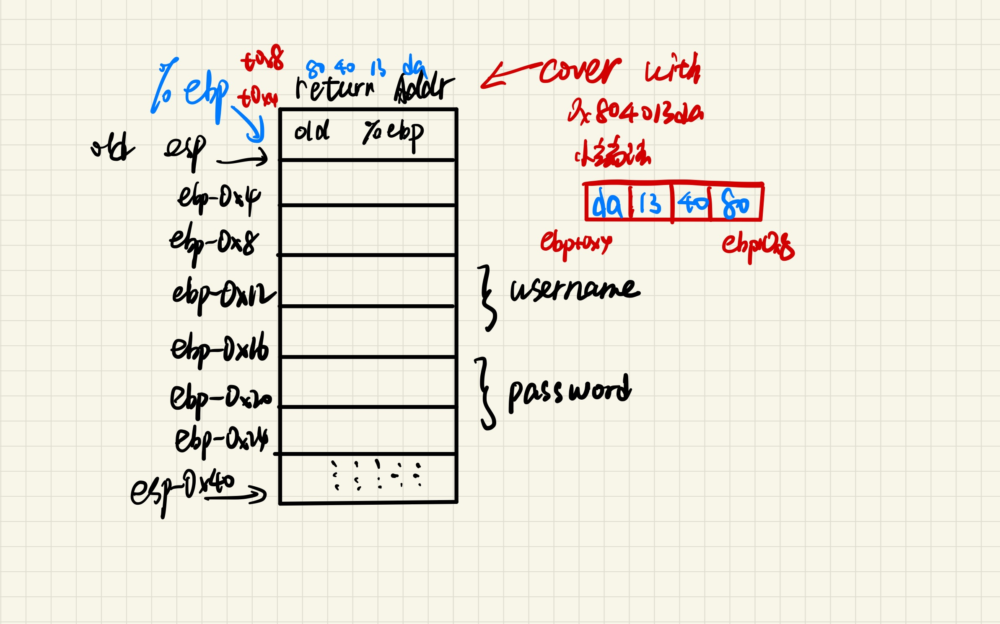

## Homework8 2023202300 张昕跃
------------------------------
### Q1
##### Suppose the address of global variable is 0x8049600, please answer the following questions.
``` c
struct data
{
  char a;
  short b[2];
  char *c;

  union
  {
    char x;
    short y;
    int z;
  } p;
  char d;
};
struct data d[2];
```
##### Fill in the form
|Variable| Start Address|
|--------|--------------|
|d[0]|0x8049600|
|d[1]|[1] 0x8049618|
|d[0].a|[2] 0x8049600|
|d[0].b[1]|[3] 0x8049602|
|d[0].c|[4] 0x8049608|
|d[0].p.y|[5] 0x8049610|
|d[0].p.z|[6] 0x8049610|
|d[0].d|[7] 0x8049614|

##### Answer1
主要要考虑到对齐的问题。char是1字节，short数组是2字节，这里需要2对齐，char*则需要8对齐。Union考虑其中最大的数据类型，也就是int=4对齐。
考虑1个data单元的大小，应该为((1+1)+2\*2+2)+8+4+1+3(最后对齐8字节)=24
[1] 因此d[1]的地址为d[0]+24
[2] a是第一个元素，也就是d[0]的地址
[3] b则是2对齐之后的地址
[4] c则需要将前面对齐为8，在d[0]基础上偏移8
[5] [6] 联合体共享地址，且都是联合体的开始地址
[7] union结束之后的地址就是d的地址

### Q2
##### What’s the output of the following C program? (on a 32-bit machine)
```c
int main()
{
  static char char_table[3][13] = {{'d', 'o', 32, 'y', 'o', 'u', 32, 'w', 'a', 'n', 't', 32, 'a'}, {32, 109, 105, 100, 116, 101, 114, 109, 32, 101, 120, 97, 109}, {0}};
  static char ans[] = "abcdefghijklmnopqrstuvwxyyz";
  printf("%s?\n", char_table);
  printf("%c%c%c!\n",
         (char)(((char **)ans)[6]),
         (char)(((char *)ans)[4]),
         (char)(ans[18]));
  return 0;
}
```
#### Answer2
第一个printf从char_table首地址开始打印直到结束(遇到\0)，也就是数组前两行。遇到的数字需要转换为ascii码，因此是 do you want a midterm exam?
第二个printf
- 第一个ans强制转换为char**，也就是指向字符指针的指针，每个指针在32位系统占4字节，因此是第7个指针的值也就是ans[24]。但是ans本身并不是指针的指针（数组指针），因此这是一个未定义行为。
- 第二个强转，将ans的地址强制转换为char*的字符桌子很，然后取第五个元素，因此会输出’e‘
- 第三个强转，直接将ans[18]的结果转换为char，也就是‘s'
因此最后的答案应该是
```txt
do you want a midterm exam?
_es //_表示Undefined behavior
```


### Q3
##### For each of the following structure declarations, determine the offset of each field, the total size of the structure, and its alignment requirement under x86-64.
- A. struct P1 { int I; char c; long j; char d;};
- B. struct P2 { long I; char c; char d; int j;}; 
- C. struct P3 { short w[3]; char c*[3]};
- D. struct P4 { struct P1 a[2]; struct P2 *p}; 
- E. struct P5 { short w[3]; char c[3]}. 

#### Answer3
<!-- |       | Offset of each field |            |            |            | Total size | Alignment |
|-------|--------------------- |------------|------------|------------|------------|-----------|
| A     | i:0                  | c:4        |            |            |            |           |
| B     |                      |            |            |            |            |           |
| C     |                      |            |            |            |            |           |
| D     |                      |            |            |            |            |           |
| E     |                      |            |            |            |            |           | -->


<table>
  <tr>
    <th></th>
    <th colspan="4">Offset of each field</th>
    <th>Total size</th>
    <th>Alignment</th>
  </tr>
  <tr>
    <td>A</td>
    <td>i:0</td>
    <td>c:4</td>
    <td>j:8</td>
    <td>d:16</td>
    <td>24</td>
    <td>8</td>
  </tr>
  <tr>
    <td>B</td>
    <td>l:0</td>
    <td>c:8</td>
    <td>d:9</td>
    <td>j:12</td>
    <td>16</td>
    <td>8</td>
  </tr>
  <tr>
    <td>C</td>
    <td>w:0</td>
    <td></td>
    <td>c:8</td>
    <td></td>
    <td>32</td>
    <td>8</td>
  </tr>
  <tr>
    <td>D</td>
    <td>a[0]:0</td>
    <td>a[1]:24</td>
    <td>p:48</td>
    <td></td>
    <td>56</td>
    <td>8</td>
  </tr>
  <tr>
    <td>E</td>
    <td>w:0</td>
    <td></td>
    <td></td>
    <td>c:6</td>
    <td>10</td>
    <td>2</td>
  </tr>
</table>

- 对于A，最大的数据类型是long，因此8对齐，最后一个d补全
- 对于B，从I开始8对齐
- 对于C，注意指针是8字节，8对齐即可
- 对于D，对齐应该是struct中最大元素的大小，因此是8
- 对于E，注意最后补齐为alignment倍数即可

### Q4
##### Suppose we have the following function ‘login’ to perform login process.
```c
int login()
{
  char username[8];
  char password[8];
  gets(username);
  gets(password);
  return check_match_in_database(username, password);
}
```

Here is a part of the function’s assembly. 
```nasm
Pushl %ebp 
movl  %esp, %ebp 
subl  $40, %esp 
leal  -16(%ebp), %eax 
movl  %eax, (%esp)
call  _gets
leal  -24(%ebp), %eax 
movl  %eax, (%esp) 
call  _gets
......
```

In the normal process, if the username and the password are both ok, the function ‘login_ok’ will be called to indicate login success. We’ve already known that the address of ‘login_ok’ is 0x804013da. Can you construct an input to make the function ‘login_ok’ be called after ‘login’ returns? You need to specify the key bytes and their positions rather than the complete input. And give one brief explanation about your input. 

#### Answer4
###### 只需要输入一个8字节的password，然后输入一个24字节的username，由于小端法存储，保证最后四个字节为0x804013da即可。
一个可行的输入是：
```txt
IMIOIMIOIMIOIMIOIMIOda134080
IMIOIMIO
```
具体这张图表示了可行性。

小端法表明高位存在低地址，而我们的最高地址(应该存80)对应输入的末尾。


