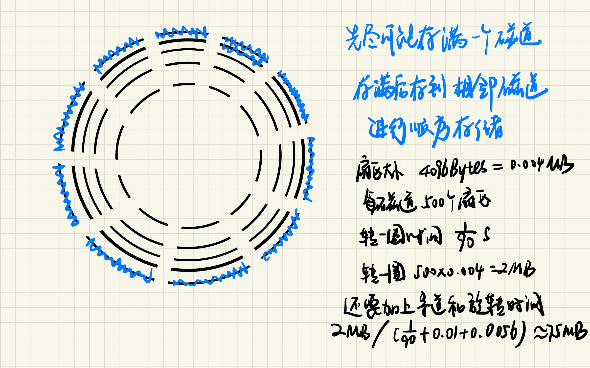
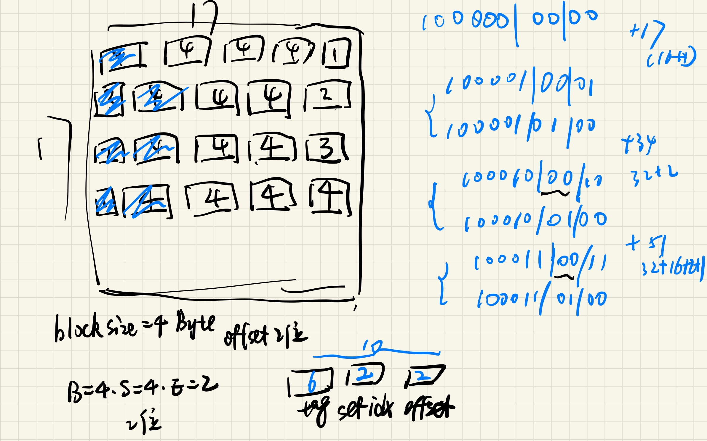
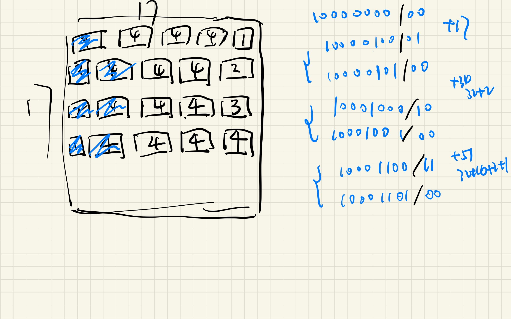

# Homework：存储 2023202300 张昕跃
------------------------------

> 本此作业统一以 $K = 10^3, M=10^6, G=10^9$ 为计量单位。以后如果遇到类似的题目请提前查看/询问/确定这件事。

> 请直接用 Markdown 题目源文件填充答案，最后统一提交 PDF 格式，比如使用 Typora 导出。

## T1

以下是A型号磁盘的相关参数

| 参数                 | 值        |
| -------------------- | --------- |
| 盘片数               | 2         |
| 每个盘片的面数       | 2         |
| 柱面数（也叫磁道数） | 500000    |
| 平均每条磁道的扇区数 | 500       |
| 扇区大小             | 4096 Byte |
| 旋转速率             | 5400 RPM  |
| 平均寻道时间         | 10ms      |

**1.1**

求该磁盘的容量（GB 为单位）。
$$1\space GB= 10^{9}\space Bytes$$ 
$$\frac{2*2*500000*500*4096}{10^{9}} = 4096 \space GB$$


**1.2.1**
$$ T_{avg \space seek} = 10 \space ms $$

$$ T_{avg\space rotation} = \frac{1}{2} *T_{max \space rotation} = \frac{1}{2} * \frac{60}{RPM}= \frac{1}{2} * \frac{60}{5400} * 1000 = 5.56 \space ms $$

$$ T_{avg \space transfer} = \frac{60}{RPM} * \frac{1}{Avg\space Sector\space per\space Track} = \frac{60}{5400} * \frac{1}{500} * 1000 = 0.022 \space ms $$

$$ T_{total} = T_{avg \space seek} + T_{avg \space rotation} + T_{avg \space transfer} = 10 + 5.56 + 0.022 = 15.582 \space ms $$
求该磁盘访问⼀个扇区的平均延迟（ms 为单位）。


**1.2.2**
 $$ Times = \frac{1}{T_{total}} = \frac{1}{15.582} * 1000 = 64\space 次 $$
求该磁盘随机读写时的每秒访问次数（IOPS）。

> 提示：思考磁盘的最小访问单位是什么，书上有提到
> 扇区中的字节
> 也是最小读写单位是扇区


**1.2.3**

求该磁盘的顺序读取带宽（MB/s 为单位）。


其中，顺序读取带宽的定义是
$$
\max\{\forall_{可以存储在磁盘A上的文件F} \frac{F的大小}{磁盘从随机时刻开始，顺序读取完F所需的期望时间}\}
$$
为了答案统一，有如下假设：

1. 不能确认为 0 的值，都认为是以平均值为期望的随机数（比如即使是顺序地访问磁道，每次寻道时间也是以平均寻道时间为期望的随机数）
2. 顺序存储的文件在相邻的扇区上是连续，当大小超过一个盘面的一个磁道可以容纳的空间时，你可以自己决定下一个开始存储的位置。显然本题你需要想一想什么存法读取时更快。

可以在答案中附上你答案对应的文件的存储方式（可以画图）

## T2

下面的表给出了一些不同的高速缓存的参数。你的任务是填写出表中缺失的字段。其中 m 是物理地址的位数，C 是高速缓存大小（数据字节数），B 是以字节为单位的块大小，E 是相联度，S 是高速缓存组数，t 是标记位数，s 是组索引位数，而 b 是块偏移位数。

| m    | C    | B    | E    | S    | t    | s    | b    |
| ---- | ---- | ---- | ---- | ---- | ---- | ---- | ---- |
| **32**   |  **1024**    | **4**    | **4**    |   **64**   | **24**  | **6**    |  **2**    |
| **32**   | **1024** | **32**   | **2**    |  **16**    |  **23**    |    **4**  | **5**     |
| **32**   | **2048** |  **8**    |  **1**    | **256**  | **21**   | **8**    | **3**    |

$$C(Cache\space Size) = B * E *S$$

$$Set\space Num(S) = 2^{s}$$ 

$$ s = log_2(S)$$

$$Block\space Size(B) = 2^{b}$$

$$ b = log_2(B) $$

根据理解写出上述公式运算即可。


## T3

假设我们有一个具有如下属性的系统:
- 内存是字节寻址的。
- 内存访问是对 1 字节字的（比如访问一个 char）。
- 地址宽 12 位。
- 高速缓存是两路组相联的(E=2)，块大小为 4 字节(B=4)，有 4 个组(S=4)。

高速缓存的内容如下，所有的地址、标记和值都以十六进制表示:

| 组索引 | 标记 | 有效位 | 字节1 | 字节2 | 字节3 | 字节4 |
| ---- | ---- | ---- | ---- | ---- | ---- | ---- |
| 0    | 00   | 1 | 40 | 41 | 42 | 43 |
|      | 83   | 1 | FE | 97 | CC | D0 |
| 1    | 00   | 1 | 44 | 45 | 46 | 47 |
|      | 83   | 0 | 54 | 55 | 56 | 57 |
| 2    | 00   | 1 | 48 | 49 | 4A | 4B |
|      | 40   | 0 | 21 | 22 | 23 | 24 |
| 3    | FF   | 1 | 9A | D0 | 03 | EE |
|      | 00   | 0 | A1 | A2 | A3 | A4 |

对于下面每个内存访问，当他们顺序执行时，指出高速缓存是否命中，如果命中且操作前的数可从已有信息判断，请给出。

| 操作 | 地址 | 命中 | 值（或未知）   |
| ---- | ---- | ---- | ---- |
| 读   | 0x834  |   **miss**   |    **Unknown**  |
| 写   | 0x836  |  **hit**    | **Unknown**     |
| 读   | 0xFFF  | **hit**     | **0xEE**     |

#### Answer3
由T2的分析可以知道得到12位地址中，倒数2位是offset，倒数4-2位是set idx，其余是tag。
对于0x834，tag=83，4=0100，set idx=1，offset=0，查找发现有效位是0，miss。
对于0x836，tag=83，6=0110，set idx=1，offset=2。此时写命中，但不知道写入什么。
对于0xFFF，tag=FF，F=1111，set idx=3，offset=3，查找发现有效位是1，hit。然后查看偏移为3的位置，发现为0xEE。

## T4

仔细阅读下面的程序，根据条件回答下列各题：

- 地址宽度为 10
- 数组的起始地址为 0b1000000000（即二进制表示）
- Block size = 4 Byte，Set = 4，两路组相连（B = 4, S = 4, E = 2）
- 替换算法为 LRU (最近最少使用)

```c
#define LENGTH 8
void clear44(char array[LENGTH][LENGTH]) {
    int i, j;
    for (i = 0; i < 4; i++)
        for (j = 0; j < 4; j++)
            array[i][j] = 0;
}
```

**4.1.1**

以上程序会发生几次缓存miss？

**4次**

由于数组是一个char且blocksize=4，每次cache会放入4个char。内层循环步长为1，在每一次行索引变化的时候会发生一次cache miss，随后三个元素都会是hit。


**4.1.2**

如果 LENGTH = 16，那么会发生几次缓存miss？

**还是4次**

16 % 4 = 0。每次加载新的行时还是能一次性读入4个char，其余原理同上。

**4.1.3**
**7次**
如果 LENGTH = 17，那么会发生几次缓存miss？

此时在读入第二行的数据时，地址是0b10000000+17=0b1010001。这时候加载的数据块为a[0][17]、a[1][0]、a[1][1]、a[1][2]，因此在a[1][3]还会出现一次cache miss。

同理，参考下图，cache miss应该是7。



同样地，4.1.4也参考此图。

**4.1.4**

请画出在 LENGTH = 17 时，程序执行结束时set0和set1的高速缓存状态，假设一开始全空。

> 可以用 `Array[0][0] ~ Array[0][3]` 的形式表示 Data 段落，有效位为 0 的行留空，每个 Set 内的顺序无所谓

| SetID | Tag | Data |
| ----- | --- | ---- |
| 0     |  **100011**   | **array[2][14] - array[3][0]**    |
| 0     |  **100010**   | **array[1][15] - array[2][1]**     |
| 1     |  **100011**   | **array[3][1] - array[3][4]**    |
| 1     |  **100010**   | **array[2][2] - array[3][5]**    |

**4.2**

修改条件为

- 地址宽度为 10
- 数组的起始地址为 0b1000000000（即二进制表示）
- Cache 的容量为 16 Byte，Block size = 4 Byte，全相联
- 替换算法为 LRU

**4.2.0**

Tag 的位数是多少？

**是8**

由于全相连说明只有一个set，因此不需要记录set idx。offset还是2位，因此**前八位是tag**。

**4.2.1**

原始程序会发生几次缓存miss？

**4次**

每一个块只有tag在变，且都加载到同一个组。因此只要tag不一样就是miss。

仍然是每一个block有连续的4个char，且第一次miss，后面三个都会连续hit。

**4.2.2**

如果 LENGTH = 16，那么会发生几次缓存miss？

**4次**

同上。

**4.2.3**

如果 LENGTH = 17，那么会发生几次缓存miss？

**7次**

画图即得。



**4.2.4**

请画出在 LENGTH = 17 时，程序执行结束时的高速缓存状态，假设一开始全空。

> 可以用 `Array[0][0] ~ Array[0][3]` 的形式表示 Data 段落，有效位为 0 的行留空

<!-- | SetID | Tag  | Data |
| ----- | ---- | ---- |
| 0     |      |      |
| 1     |      |      |
| 2     |      |      |
| 3     |      |      | -->

| SetID | Tag  | Data |
| ----- | ---- | ---- |
| 0     | **10001101** |  **array[3][1] - array[3][4]**    |
