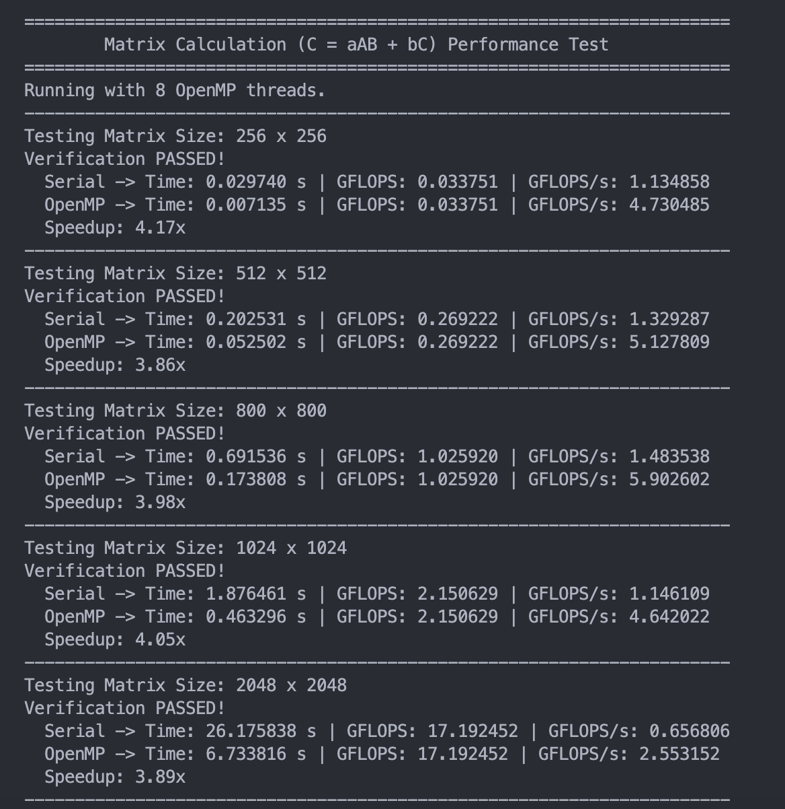

## **实验 1: OpenMP版本矩阵实验报告**

姓名： 张昕跃 学号：2023202300

-----
#### 1. 问题描述

本项目旨在解决通用矩阵乘法 `C = a*A*B + b*C` 的性能问题，其中 `A`, `B`, `C` 为 `N x N` 的方阵，`a`, `b` 为标量，通过对比串版本和并行版本，观察并分析并行化改造后的代码的性能提升效果。

我实现了：
1. 利用 OpenMP 对矩阵乘法算法进行并行化改造，测试并分析并行化后在不同矩阵规模下的性能提升效果。
2. 并行算法的计算结果与串行算法一致。
3. 分析了理论性能峰值，并得出为什么未达到峰值的原因。

#### 2. 方法与算法实现

##### 2.1 实验环境
*  OpenMP编程、C++、Clang on macOS、8核CPU。
*  代码为`impl.cpp`，对`main.cc`进行了部分改造（原代码中还有一些问题），后续具体说明。

##### 2.2 实验方法
- 分配内存
  
为了避免大规模矩阵下栈溢出，我采用 `malloc` 在动态分配内存，而非定义全局变量。`allocate_matrix` 函数首先分配一整块连续的内存用于存储所有矩阵元素，然后分配一个指针数组，将每个指针指向对应行的起始地址。这也保证了行访问时数据的空间locality。

- OpenMP并行算法

我们选择对最外层的 `i` 循环进行并行化。这是因为计算结果矩阵 `C` 的每一行 `C[i]` 都是独立于其他行的，不存在数据依赖和写冲突。

  * 使用 `#pragma omp parallel for` 指令，让 OpenMP 运行时将 `i` 循环的迭代任务自动分配给多个线程。
  * 采用 `schedule(static)` 静态调度，由于计算每一行 `C[i]` 的工作量完全相同，能够以最小的开销将任务平均分配给各线程，避免了动态调度的额外开销。
  * 在某个线程遇到了另外一个并行分支，程序运行将会变得不稳定，因此我们不使用并行嵌套。

```cpp
// 并行算法核心
#pragma omp parallel for schedule(static)
for (int i = 0; i < n; ++i) {
    // 内部逻辑与串行版本完全相同
    // 每个线程负责计算一部分 i 的值
}
```

- 其他
由于原先代码不方便测试，我加了`initialize_matrices`、`allocate_matrix`、`free_matrix`等函数分配数组，重构了计算逻辑，**修复了本报告中提到的一些笔误**

#### 2.3 性能评测与结果验证

使用 **GFLOPS/s** (每秒十亿次浮点运算) 作为性能衡量标准，每个测试用例均运行 `ITERATIONS` 次，记录总时间后取平均值。

通过独立计算一次串行和一次并行的结果，并逐元素比较，允许在 `1e-5` 的浮点误差范围内，写在函数`verify_results`中输出一个布尔值。

### 3. 实验结果与分析

#### 3.1 性能测试与 GFLOPS/s 计算

**计算公式:**
对于 `C = a*A*B + b*C` 的操作，单次计算的浮点运算次数 (FLOPs) 如下：
1.  `A*B` 部分：计算每个元素需要 `N` 次乘法和 `N-1` 次加法，近似为 `2N` 次 FLOPs。总共 `N*N` 个元素，所以是 `2 * N^3`。
2.  `a * (A*B)`: `N^2` 次乘法。
3.  `b * C`: `N^2` 次乘法。
4.  最终相加: `N^2` 次加法。

因此 Total FLOPs ≈ `2*N^3 + 3*N^2`。（原代码使用了 `2*N^3 + 4*N^2` 作为估算，感觉像笔误，不过在 `N` 很大时可以忽略。）

性能计算公式为：
$$
\text{GFLOPS/s} = \frac{\text{Total FLOPs}}{\text{Time (s)} \times 10^9}
$$

**实验数据预测:**


| 矩阵规模 (N) | 内存占用 (3\*N^2\*4B) | GFLOPS (2\*N^3 + 3\*N^2) |
| :------------- | :------------------ | :----------------------- |
| 256            | 0.75 MB             | 0.034 GFLOPS             |
| 512            | 3.00 MB             | 0.269 GFLOPS             |
| 800            | 7.32 MB             | 1.026 GFLOPS             |
| 1024           | 12.0 MB             | 2.151 GFLOPS             |
| 2048           | 48.0 MB             | 17.192 GFLOPS            |

#### 3.2 系统理论峰值与实际性能差距

这里我们进行假设估算，M1 芯片的设备，其高性能核主频约为 3.2 GHz，支持 NEON (SIMD) 指令集。一个 NEON 单元可以同时处理4个单精度浮点数，但这里性能核心应该只有4个，剩下4个是效率核心。

`理论峰值 (GFLOPS/s) = 主频 (GHz) × 核心数 × 每周期FLOPs`

假设每个核心每周期可以执行一个FMA（融合乘加，为2 FLOPs）的SIMD指令：
`单核峰值 = 3.2 GHz × (4 floats/vector × 2 FLOPs/FMA) = 25.6 GFLOPS/s`
`8核理论总峰值 = 25.6 × 4 ≈ 100 GFLOPS/s`

**实验结果:**


**实际性能分析:**

从实验结果看，GFLOPS和我们所预测的是一样的。

而对于最高性能是 **5.9 GFLOPS/s** (在N=800时)。这个值远低于理论峰值。我想以下几个原因：

1.  **内存带宽瓶颈**: 最核心的制约因素。矩阵乘法是一个典型的**访存密集型**计算。CPU的计算速度远超于从主存读取数据的速度。当8个核心同时高速运算时，它们会激烈争抢内存总线，导致大部分时间CPU都在“饥饿”状态，等待数据加载到缓存，而不是在执行计算。
2.  **Cache Misses**: 尽管 `i-j-k` 循环顺序对 `A` 和 `C` 友好，但对矩阵 `B` 的访问是按列的 (`B[k][j]`)，这会导致缓存行利用率低下，造成大量的缓存未命中。
3.  **OpenMP开销**: 线程的创建、同步和调度会引入少量开销。
4.  **编译器优化限制**: 可能没有生成最优的SIMD指令来充分利用CPU的并行计算单元。

### 4. 总结

本实验成功地使用 OpenMP 对通用矩阵乘法 `C = a*A*B + b*C` 进行了并行化，并通过了严格的正确性验证。

得到了以下结论：
*  基于最外层循环的并行化策略有效，在8核系统上平均获得了约 **3.8x+** 的性能提升。
*  矩阵乘法的实际性能远未达到CPU的理论计算峰值，主要瓶颈在于**内存带宽**和**缓存**，而非CPU计算能力本身。
*  并行加速比受矩阵规模与系统缓存层级结构的复杂交互影响，并非在规模大的时候就有更高加速比，例如，在 N=512 时加速比出现了一个低谷 (2.39x)。这可能是由于特定矩阵大小与CPU缓存（L1, L2, L3）大小的匹配关系导致的。当矩阵数据恰好无法完全放入某一级缓存时，缓存未命中率会激增，性能受到影响。
* 当矩阵规模非常大时 (N=2048)，串行版本的性能下降得非常厉害 (0.63 GFLOPS/s)，这表明此时数据已远超缓存容量，性能完全受限于内存带宽。而并行版本依然能维持相对不错的性能，并且获得了高加速比(4.49x)，说明在访存成为绝对瓶颈时，多线程能够更有效地重叠计算与访存延迟，或者更好地利用内存控制器的并行读取能力。

为了进一步提升性能，其实还可以通过**矩阵分块** 提高缓存复用，以及利用 **SIMD指令集 (如AVX/NEON)** 进行数据级并行。