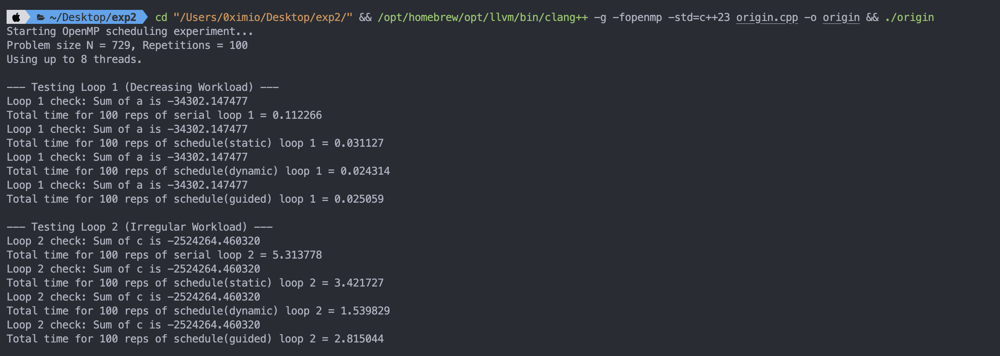

### **实验 2 报告: 测量 OpenMP 并行 for 循环不同调度策略**

**姓名:** 张昕跃 **学号:** 2023202300

#### **1. 实验环境及问题解决**

*   **环境**: 8核CPU、MacOS、Clang编译，循环迭代次数 N = 729, 重复执行次数 reps = 100。

*  **实验方法**: 本实验测试两个典型的负载不均衡场景，对外层循环进行三种不同策略并行并分析结果：

1.  **测试用例1 (Loop 1 - 递减负载)**:
    该循环的外层迭代变量为`i`，内层循环的迭代次数为 `N-1-i`。随着`i`从0增加到N-1，每次外层迭代的计算量线性减少。
    由于lo取0，hi取N，因此这里其实相当于上三角矩阵的运算。

2.  **测试用例2 (Loop 2 - 不规则负载)**:
    该循环的计算量由数组`jmax[i]`决定。
    `jmax[i]`的值被设置为1（计算量极小）或N（计算量极大），且值为N的情况是稀疏分布的，且随着i的递增，jmax取到N的概率越来越小。是计算量不均衡且尾部小任务占比更高。

针对以上两种情况，测量对比以下四种情况的运行时间：
*   **`Serial`**: 串行执行，作为性能基准和正确性测试。
*   **`schedule(static)`**: 静态调度，将迭代空间均分给各线程。
*   **`schedule(dynamic)`**: 动态调度，线程空闲动态请求下一个迭代任务。
*   **`schedule(guided)`**: 引导调度，最开始分配较大的块，随着任务推进，块大小逐渐减小
  
预测结果：
Loop1  :   Dynamic ≈ Guided > Static
Loop2  :   Dynamic > Guided > Static

#### **2. 实验结果**

所有并行测试的计算结果（`sum of a and c`）均与串行版本完全一致，验证了并行正确性。详细的性能测量数据如下，具体结果见文后运行截图。

**表1：Loop 1 (递减负载) 性能测量结果 (8线程)**

| 调度策略        | 执行时间 (秒) | 加速比 (Speedup vs. Serial) |
| :-------------- | :------------ | :-------------------------- |
| **Serial**      | 0.112266      | 1.00x                       |
| **static**      | 0.031127      | 3.61x                       |
| **dynamic**     | **0.024314**  | **4.62x**                   |
| **guided**      | 0.025059      | 4.48x                       |

**表2：Loop 2 (不规则负载) 性能测量结果 (8线程)**

| 调度策略        | 执行时间 (秒) | 加速比 (Speedup vs. Serial) |
| :-------------- | :------------ | :-------------------------- |
| **Serial**      | 5.313778      | 1.00x                       |
| **static**      | 3.421727      | 1.55x                       |
| **dynamic**     | **1.539829**  | **3.45x**                   |
| **guided**      | 2.815044      | 1.89x                       |

#### **3. 结果分析**

##### **3.1 Loop 1 (递减负载)**

此场景下，负载不均且线性变化。
*   **`static` 策略表现最差**: `static`调度将迭代任务预先平均分大块。第一个线程分到了`i`值较小的任务，计算量最重；而最后一个线程分到了`i`值较大的任务，计算量最轻。导致了严重的**负载不均**，后几个线程早早完成并进入空闲等待状态，程序的总时间由最慢的第一个线程决定，因此加速比低。

*   **`dynamic` 和 `guided` 策略表现优异且接近**: 这两种动态调度策略都能有效地解决负载不均衡问题。并非均匀分配任务，而当一个线程完成其任务后，会立即请求新的任务，从而帮助处理尚未完成的工作。
    *   **`dynamic`** 微弱优势胜出，以最小的粒度（默认为1）分派任务，实现了精细的负载均衡。
    *   **`guided`** 采用“先大块后小块”的策略，在减少**调度开销和负载均衡**之间取得了很好的平衡。两者性能的微小差异可能源于本次实验总规模还不够大，`dynamic`更精细所以表现更好。

##### **3.2 Loop 2 (不规则负载)**

此场景下，负载不均且稀疏分布。
*   **`static` 策略表现最差**: 由于计算量大的“重量级”任务少，静态均分任务块的策略有极大概率将重量级任务全部分给同一个线程。结果是，一个线程在承担几乎全部的计算工作，而其他7个线程瞬间完成自己“轻量级”任务的工作后，便进入了漫长的等待，效率接近串行。

*   **`dynamic` 策略表现最好**: `dynamic`策略`按需分配`的机制确保了任何一个线程只要空闲，就会立即参与到计算中。这使得所有线程都能公平地分担那些稀有但耗时的重量级任务，实现了最大程度的负载均衡。

*   **`guided` 策略表现一般**: `guided`的问题在于它初始分配的任务块较大。某个线程会被分到包含重量级任务的大块中，严重拖慢进度，导致初期的负载不均衡。虽然后期会通过分配小块来弥补，但对于这种“非1即N”的极端负载模式，其反应速度和均衡效果不如纯粹的`dynamic`。

#### **4. 实验结论**

1.  OpenMP中`for`循环的调度策略对并行程序性能有决定性影响，必须根据循环的负载特性进行审慎选择。
2.  **`schedule(static)`** 调度开销最小，但仅适用于每次迭代计算量一致的循环。任何负载不均衡的场景，都会导致严重的性能瓶颈。
3.  **`schedule(dynamic)`** 具有高灵活性和负载均衡能力，计算量不规则或不可预测时首选。
4.  **`schedule(guided)`** 折中调度开销和负载均衡，适用计算量呈现规律性变化且一开始有大任务，后续任务量变的细碎的循环。

并行化程序不能简单添加并行指令，需要分析算法特性，选择最匹配的并行策略，才能得到更高加速性能。

#### 附录（运行结果截图）

