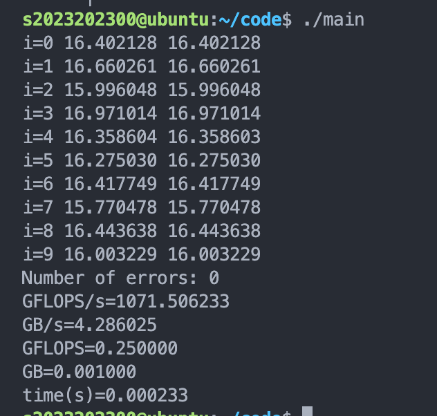
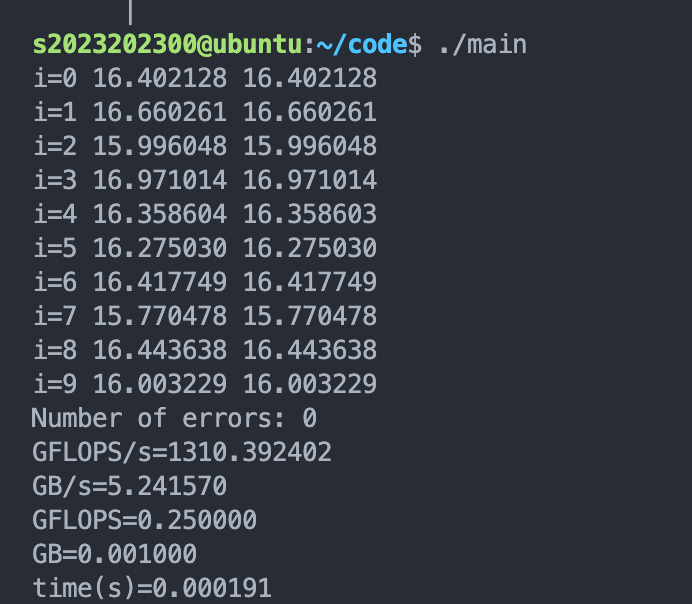

#### 实验 3: CUDA版本矩阵矩阵乘

##### **姓名:** 张昕跃 **学号:** 2023202300
---

#### 1. 问题描述

在这个实验中，我实现了：

1.  **Shared Memory 优化**：用 Shared Memory 改进了原来从每次都直接读写内存的矩阵乘法算法，使全局访存减少了 32 倍；
2.  **访存策略优化**：考虑了线程访问策略，尽量多地消除了 Bank Conflict；
3.  **Blocking 与循环展开**：在 Blocking 优化上，我通过测试参数的方式，发现使用 **32×32** 的小矩阵进行分块计算，可以将每个元素重用 32 次（在 N 整除的时候）；我还用 `#pragma unroll` 进行循环展开提高了计算效率；
4.  **正确性验证**：保证了矩阵乘法的正确性。具体来说，我只修改了 `sgemm` 函数和辅助矩阵的维度，并通过了正确性测试。

---

#### 2. 问题回答

##### 1. 根据内存大小测不同规模矩阵的处理速度（GFLOPS／秒）和带宽利用情况，并给出计算公式。

计算 $A \times B$ 的矩阵乘法，理论上计算每个元素需要 $N$ 次乘法和 $N-1$ 次加法，近似为 $2N$ 次 FLOPs。总共 $N \times N$ 个元素，所以总运算量是 $2 \times N^3$。

*   **GFLOPS 计算：**
    $$ \text{GFLOPS} = \frac{\text{FLOPS}}{10^9} $$
    这里取 $N=500$，计算可得 $\text{GFLOPS} = 0.250000$，与实验结果吻合。

*   **带宽利用情况：**
    $$ \text{Bandwidth} = \frac{\text{总数据量 (GB)}}{\text{执行时间 (秒)}} $$
    这里的总数据量按 $N \times N$ 个 `int`（4字节）计算，所以总数据量是 $0.001 \text{ GB}$。
    *   **分母**：时间是浮动的，根据我们的性能决定。
    *   **分子**：是固定的，前述已根据 $N=500$ 给出。

##### 2. 请计算系统的理论峰值，如果没有达到理论峰值，尝试给出原因。

**理论峰值计算公式：**
$$ \text{理论峰值} = \text{CUDA核心数} \times \text{时钟频率} \times \text{每周期运算数} $$

**通过计算运行发现：**
*   **Number of SMs:** 68
*   **CUDA Cores per SM:** 64 (estimated)
*   **GPU Clock Rate:** 1.54 GHz
*   **每周期运算数:** 2 (因为 FMA 指令一次完成乘+加)

**计算结果：**
$$ 68 \times 64 \times 1.54 \times 2 = \mathbf{13404.16 \text{ GFLOPS}} $$

**没有达到理论峰值的原因：**
1.  **访存瓶颈**：计算单元 ALU 运算速度通常远快于访存获取数据的速度。理论峰值考虑的是一直在计算，没有任何访存，而实际运行中有大量的 Cache Miss，没有完全复用 Cache。
2.  **Shared Memory 容量限制**：一个 Block 最多只能有 1024 个线程，所以我的 `BLOCK_SIZE` 最大只能调到 32，不能有再高的复用度了。
3.  **Occupancy 限制**：由于分块的小矩阵为 32×32，可能导致同一个 SM 上能跑的 Block 变少，降低 Occupancy，从而降低并发度。
4.  **Warp Divergence**：边界处理可能存在 Warp Divergence，降低了效率。
5.  **其他开销**：可能仍存在少量的 Bank Conflict 以及分支预测错误带来的惩罚。

---

## 3. 具体实现和分析

**我的实现流程如下：**

1.  **矩阵分块**：将结果矩阵 $C$ 分成 `BLOCK_SIZE` × `BLOCK_SIZE` 的子矩阵。这里由于一个 Block 最多只能有 1024 个线程，我们的最大并行度取 `BLOCK_SIZE` 只能为 32。
2.  **任务分配**：每个 Thread Block 计算一个子矩阵，将其所需的 $A$ 和 $B$ 的数据分批次加载到 Shared Memory。
3.  **计算**：在 Shared Memory 中进行乘法累加得到 `Csub`。
4.  **写回**：最后将结果写回全局内存。

具体来说，我通过重新计算行列的方式，分配 Shared Memory 的方式，减少了计算 32×32 分块矩阵时候每次对主存的访问，而是一次性读取用共享内存运算。

每个 Thread Block 使用两个 32×32 的 Shared Memory 数组来缓存矩阵 $A$ 和 $B$ 的块：

```cpp
__shared__ float As[BLOCK_SIZE][BLOCK_SIZE];
__shared__ float Bs[BLOCK_SIZE][BLOCK_SIZE];

int row = by * BLOCK_SIZE + ty;
int col = bx * BLOCK_SIZE + tx;
```
通过 `tx` 作为列索引，`ty` 作为行索引，访问模式做到了**合并内存访问 (Coalesced Access)**。

**核心加载矩阵和计算的代码如下**（这里省略了 N 的越界检查）：

```cpp
for (int m = 0; m < numTiles; m++) {
    // 1. 加载A和B的分块矩阵到shared memory
    As[ty][tx] = A[row * n + aCol];
    Bs[ty][tx] = B[bRow * n + col];
    __syncthreads();

    // 2. 在shared memory中计算部分结果
    #pragma unroll
    for (int k = 0; k < BLOCK_SIZE; k++)
        Csub += As[ty][k] * Bs[k][tx];
    __syncthreads();
}
```

**关于消除 Bank Conflict 的分析：**
*   **对 A**：32 个线程都访问 `As[ty][k]`（同一个地址）。32 个线程读同一地址，Shared Memory 会自动广播 (Broadcast)，**无 Bank Conflict**。
*   **对 B**：`Bs[k][tx]` 的地址 $= \text{base} + (k \times 32 + tx) \times 4 \text{ bytes}$。
    *   Bank 编号 $= (k \times 32 + tx) \% 32$。
    *   对于 Thread $i$: 访问 `Bs[0][i]` $\rightarrow$ bank $(0 \times 32 + i) \% 32 = i$。
    *   32 个线程访问 32 个不同的 Bank，**无冲突**。$k$ 从 0-31 都是如此。

对于加载内存的时候也是一样，我们消除了 Bank Conflict。
同时，算点积累加到 `Csub` 上的时候我使用了 `#pragma unroll` 循环展开，提高计算效率。

### 实验结果

代码在**main.cu**中。

优化前没有使用Shared Memory、blocking优化和消除bank conflict的结果


使用Shared Memory、blocking优化和消除bank conflict的结果
