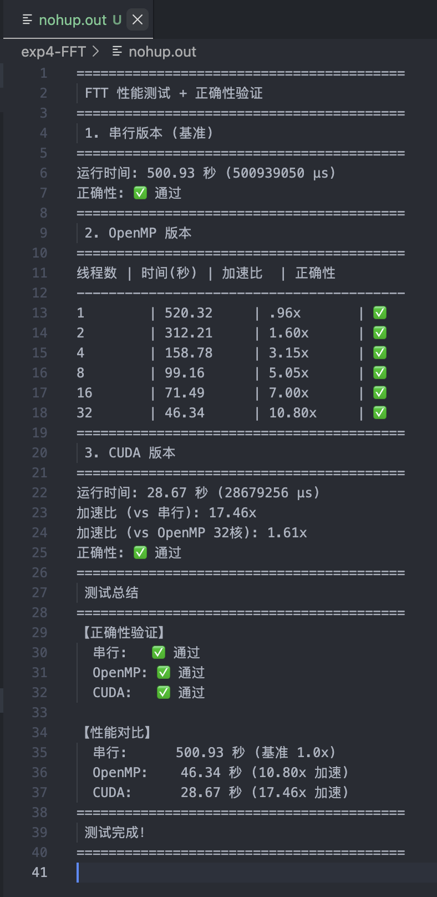

### 实验 4: 傅里叶空间图像相似度计算

**姓名:** 张昕跃 &nbsp;&nbsp;|&nbsp;&nbsp; **学号:** 2023202300

---

#### 1. 问题描述
在这个实验中，我实现了：

1.  **OpenMP CPU 并行化**：利用 `#pragma omp` 指令实现循环并行，结合 `reduction` 规约避免数据竞争，并采用 `static` 调度策略配合 `-O3` 编译选项提升性能。
2.  **CUDA GPU 并行化**：重构了底层数据结构，实现支持 GPU 运算的 `Complex` 类；设计 `ComputeKernel` 实现细粒度的并行计算；利用 **Shared Memory (共享内存)** 和 **两阶段树形归约算法** 优化内存访问与求和效率。
3.  **测试**：重写了 `Makefile` 以支持多版本编译，并编写`check.py` 和 `benchmark.sh` 脚本进行正确性检查和性能对比。

---

#### 2. 具体实现与分析

##### 2.1 OpenMP 并行 CPU 版本

`main.cpp` 中的 FFT 基础逻辑保持不变，只需修改 `logDataVSPrior` 函数。

**主要优化策略：**
1.  **多线程并行**：使用 `#pragma omp parallel for` 将原本单核串行的 `for` 循环转化为多核并行执行。
2.  **归约优化**：使用 `reduction(+:result)` 为每个线程创建私有的 `result` 副本进行局部累加，最后安全合并，彻底消除了data race。
3.  **负载均衡**：由于循环体内每次迭代的计算量固定（复数减法、模运算、乘法），选用 `schedule(static)` 调度策略以减少运行时开销。
4.  **编译优化**：在 Makefile 中开启 `-fopenmp -O3 -march=native -ffast-math` 选项。
```cpp
// OpenMP parallel region with reduction and static scheduling
#pragma omp parallel for reduction(+:result) schedule(static)
for (int i = 0; i < num; i++){
    result += (norm(dat[i] - ctf[i] * pri[i]) * sigRcp[i]);
}
```

##### 2.2 CUDA 并行 GPU 版本

GPU 版本的实现需要重写数据结构和写计算与规约kernel。

##### A. 准备工作（需要重写新写重构的）：
1. 数据准备上要把数据从cpu malloc到gpu上；
2. 添加了错误检查宏`#define CUDA_CHECK(call)`检查内存分配回收是否成功；
3. 我们需要先重写`complex`结构使得 GPU 也能调用，即添加` __host__ __device__`然后重载一下运算符；
4. 计算方差 norm 放在 GPU 上并行，添加`__device__`

#### B. 具体计算实现计算kernel：
1. `computeKernel`需要由CPU启动然后调用GPU在其上执行，添加`__global__`
2. 更具体来说，计算 `idx = blockIdx.x * blockDim.x + threadIdx.x` 计算线程全局索引，每个线程并行处理一个元素计算


#### C. 获得最终结果实现规约kernel：
1. 并行归约 reductionKernel，也要添加`__device__`
2. **分配共享内存**，加载一个block中的input到共享内存，然后在分配的**sdata共享内存**中进行树型规约，而不是用**全局变量（有锁竞争）**
3. 不过这里还需要写一个`deviceReduce`，因为这个kernel只完成了block内求和，还需要把每个块结果加起来，在其中**递归调用规约kernel**即可
4. **一定要注意用 __syncthreads(); 同步，等待规约结果累加！！！**


#### D. 最终计算修改`logDataVSPrior`函数
**launch计算kernel，并归约求和**（这个是包装的kernel reduction函数）。这里需要补一个`d_partial`指针存每个线程中间结果，然后规约，不然会造成data race。
```cpp
const int blockSize = 256;
const int gridSize = (num + blockSize - 1) / blockSize;
// 1. 启动计算 Kernel，计算部分和并存入 d_partial
computeKernel<<<gridSize, blockSize>>>(d_dat, d_pri, d_ctf, d_sigRcp, d_partial, num);
// 2. 执行归约操作获取最终结果
double result = deviceReduce(d_partial, num);
```

---

#### 3. 实验结果
项目代码已打包在了submit文件夹中。新实现或更改的内容包含：`main_openmp.cpp`、`main_cuda.cu`、`Makefile`、`check.py`、`benchmark.sh`

##### 正确性验证
由于浮点数运算存在误差，题目要求**有效数字误差不大于十万分之一**，单纯的 `diff` 可能有问题。因此编写了 python 脚本进行校验，计算两个结果文件的相对误差。

##### 性能测试
对于性能提升和各实现的正确性，我写了 `benchmark.sh` 脚本。
1. 编译所有版本，调用`check.py`检查结果是否合理；
2. 运行并记录耗时（其中对于**OpenMP 版本**，循环设置不同的线程数（1, 2...，32），记录不同并行线程下的表现。）
3. 计算性能提升（加速比），并对比结果。
> 测试方法：可以用 make all 编译全部，或者用 make serial / openmp / cuda 编译特定版本
> 全部编译后可以直接用 ./benchmark.sh 进行全部测试

这里由于挂前台运行太慢，我直接用`nohup ./benchmark.sh &`放后台运行了，所以输出在`nohup.out`中。结果如截图所示：


分析实验结果，用openMP并行优化确实可以提高效率，且随着并行核数增大，加速比越高。但根据Amdahl定律也知道这不是线性提升的。
且要注意，CPU核数是有限的，假如`export OMP_NUM_THREADS`超过32，实验结果就是错的了。

CUDA的GPU并行结果比OpenMP32核并行还要快一倍，加速比也是串行版本的17x+。
没有达到更高的原因可能如下：
1. 由于**K 次迭代循环在 CPU 端**，需要导致频繁的 kernel 启动；
2. GPU还需要进行全局同步的归约操作，限制了并行度

