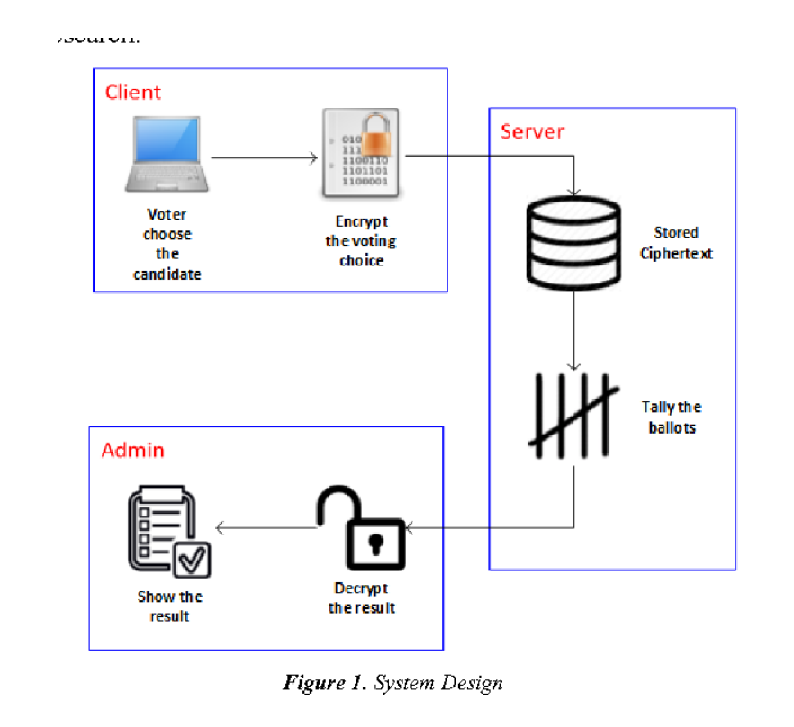

### 实验 5：基于 GPU 的加法同态加密算法

------

### 1. 目标

通过本次作业了解 GPU 加速在安全领域中的运用。

### 2. 问题描述

Paillier、Okamoto-Uchiyama（下文简称 OU）等同态加密算法已经在隐私计算领域大量应用，但是相比 FL、MPC 等其它隐私计算方案，同态加密的计算性能非常低，是隐私计算大规模应用的瓶颈。虽然隐语也尝试过用 FPGA 等硬件加速 Paillier 并取得一定效果，但是这类方案与硬件型号存在绑定关系，一旦 FPGA 型号变化则算法不再适用。GPU 作为一种通用硬件，普及面好，基于 GPU 加速同态加密算法可以使更多用户受益。

### 3. 实验提示

*   调研 Paillier 和 Okamoto-Uchiyama 算法，寻找合适的算法进行实现。

### 4. 要求

*   **正确性**
    完成基于 GPU 加速的 Paillier、OU 算法设计和实现工作，支持主流商用、民用 GPU 卡，并且算法功能正确，无明显安全漏洞。
*   **实验结果**
    GPU Paillier、OU 的性能要明显优于 CPU 版本。
*   **实验分析**
    页数限制 2 页，打印出来即一张纸的正反面，在有限的篇幅内说明清楚即可。