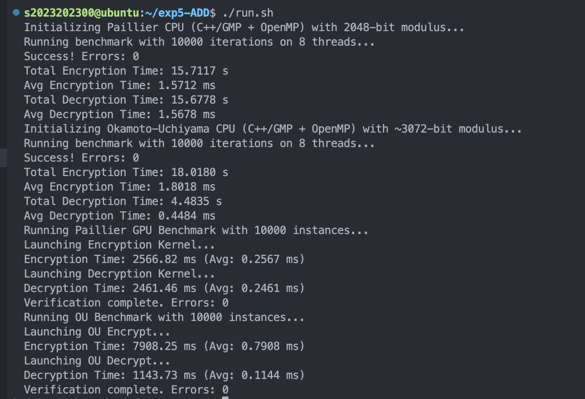

# 实验 5（选做）：基于 GPU 的加法同态加密算法

**姓名:** 张昕跃 &nbsp;&nbsp;|&nbsp;&nbsp; **学号:** 2023202300

---

## 1. 问题描述

这个实验中，我实现了两种加法同态加密算法的 CPU 和 GPU 加速版本，用 CUDA 和 CGBN 库实现了 GPU 并行版本；用 OpenMP 实现了 CPU 8线程版本作为对比，分析了性能差异

1. **Paillier 加密系统**：基于复合模数 n=pq 的加法同态加密
2. **Okamoto-Uchiyama (OU) 加密系统**：基于 n=p²q 结构的加法同态加密

---

## 2. 方法与算法思路

### 2.1 Paillier 加密算法

Paillier 基于复合模数 n=pq（2048-bit）实现加法同态。加密公式为 `c = (1 + m·n) · r^n mod n²`，解密通过 `m = L(c^λ mod n²) · μ mod n` 恢复明文。

实现上，我用 `bn_wide_t`（8192-bit）存储中间乘法结果，通过 `mul_wide` 和 `rem_wide` 避免 4096-bit 运算溢出。

### 2.2 Okamoto-Uchiyama 加密算法

OU 基于 n=p²q（3072-bit）结构。加密公式为 `c = g^m · h^r mod n`，解密通过计算 `L(c^(p-1) mod p²) / L(g^(p-1) mod p²) mod p` 恢复明文。

实现上，我预先对密文取模（`c mod p²`）并使用 `mul_wide` 处理两次模幂运算的乘法结果。

### 2.3 GPU 实现

具体业务有点复杂，这里就不贴出来了，但具体解决了以下bug/难点才使最终答案是正确的。

1. **CGBN 宽变量使用**：使用 `bn_wide_t`（8192-bit）存储中间乘法结果，避免 4096-bit × 4096-bit 溢出问题
2. **内存管理**：正确使用 `cgbn_mem_t<BITS>` 类型转换，并计算：`ptr + instance * LIMBS` 指针偏移
3. **并行**：GPU每个 warp（32 线程）处理一个大数实例

### 2.4 CPU 实现（OpenMP）

使用 GMP 库进行大整数运算，OpenMP 实现并行化：

```cpp
#pragma omp parallel
{
    gmp_randstate_t thread_state;
    gmp_randinit_default(thread_state);
    gmp_randseed_ui(thread_state, time(NULL) ^ omp_get_thread_num());

    #pragma omp for
    for (int i = 0; i < count; i++) {
        paillier_encrypt(ciphers[i], msgs[i], &ctx, thread_state);
    }
    
    gmp_randclear(thread_state);
}
```

---

## 3. 代码、编译与运行

两个CPU版本和两个GPU版本的代码都在压缩包中，我写了一个run.sh脚本可以一键编译和运行，同时把输出打印到对应的txt文件中，运行环境在学校下发的服务器里。

---

## 4. 实验结果（10,000 次操作）与分析

#### Paillier 加密

| 操作 | CPU 时间 | GPU 时间 | **加速比** |
|------|---------|---------|-----------|
| Encrypt | 1.5712 ms | 0.2567 ms | **6.12×** |
| Decrypt | 1.5678 ms | 0.2461 ms | **6.37×** |

**分析**：
- GPU 在 Paillier 加密和解密上都获得了**超过 6 倍**的显著加速
- 加密和解密性能相当，说明两个操作的计算复杂度相似
- 因为 Paillier 的主要开销都在模幂运算 `r^n mod n²` 和 `c^λ mod n²`

#### Okamoto-Uchiyama 加密

| 操作 | CPU 时间 | GPU 时间 | **加速比** |
|------|---------|---------|-----------|
| Encrypt | 1.8018 ms | 0.7908 ms | **2.28×** |
| Decrypt | 0.4484 ms | 0.1144 ms | **3.92×** |

**分析**：
- OU 加密的加速比（2.28×）低于 Paillier，可能原因：
  1. OU 需要**两次模幂运算**：`g^m mod n` 和 `h^r mod n`
  2. 3072-bit 模数比 Paillier 的 2048-bit 更大
  3. GPU 对更复杂算法的优化空间有限
- OU 解密获得了 **3.92× 加速**，因为解密计算量相对较小

详情还可见results.txt文件
