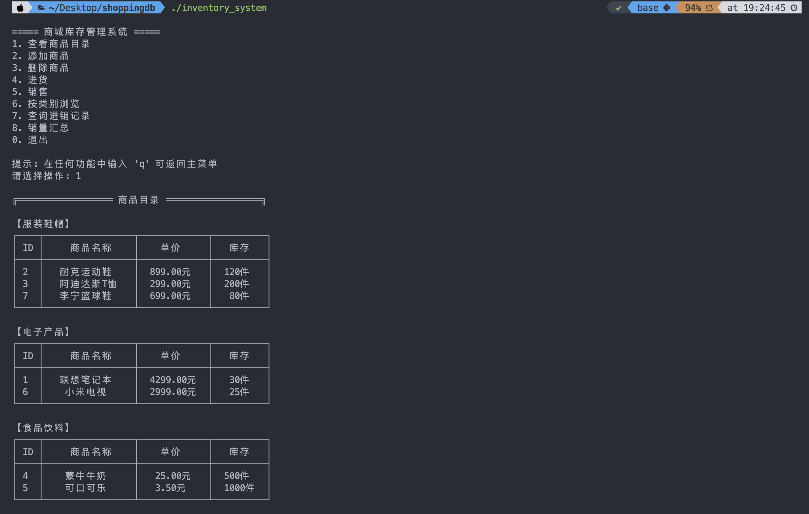
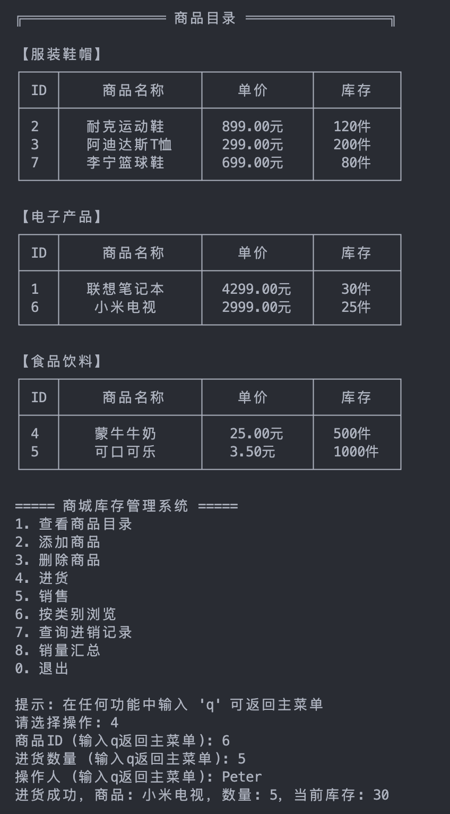
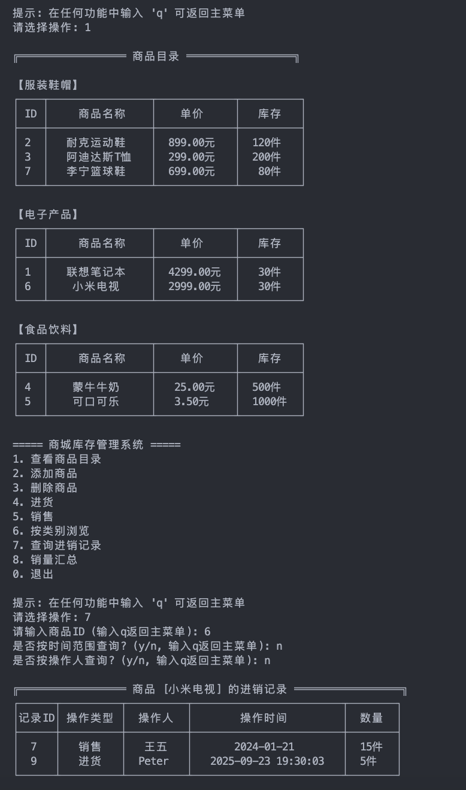
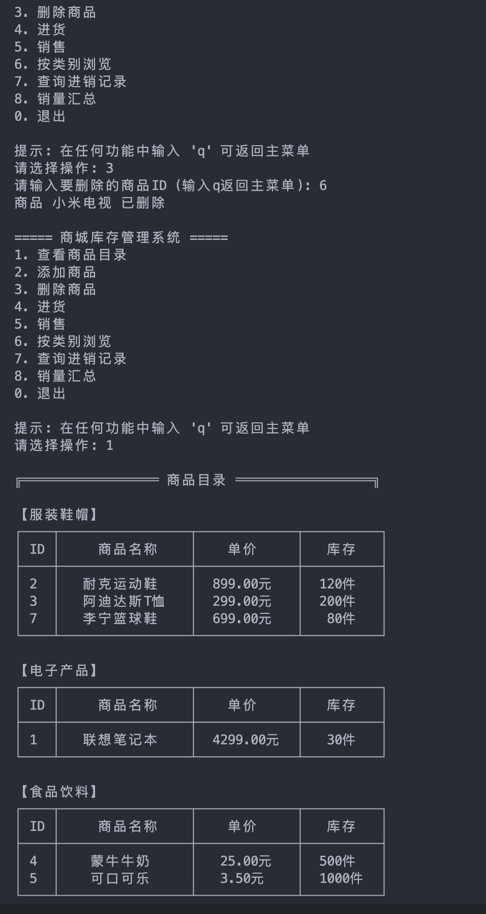
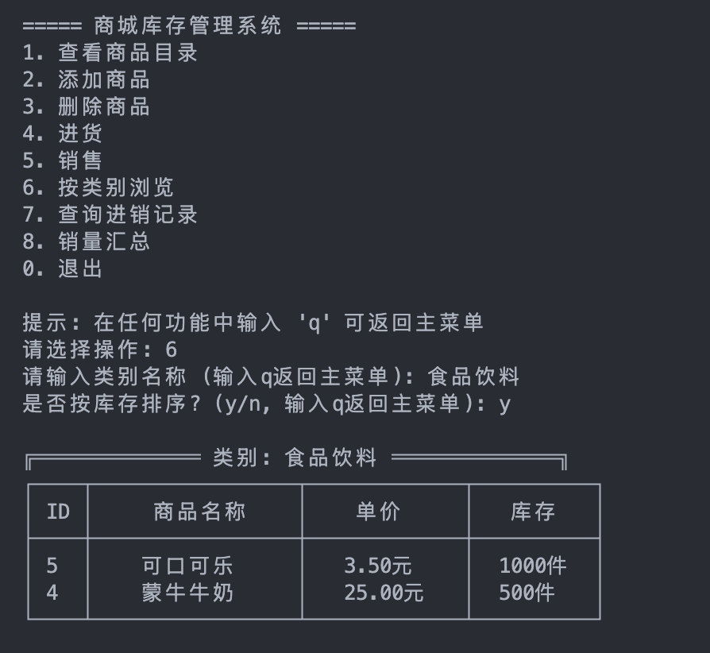
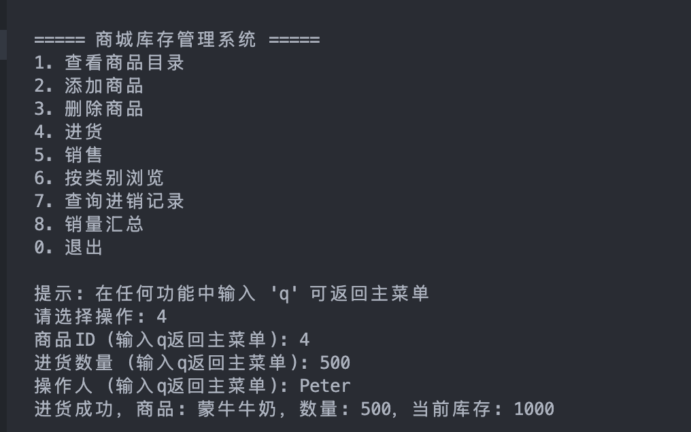
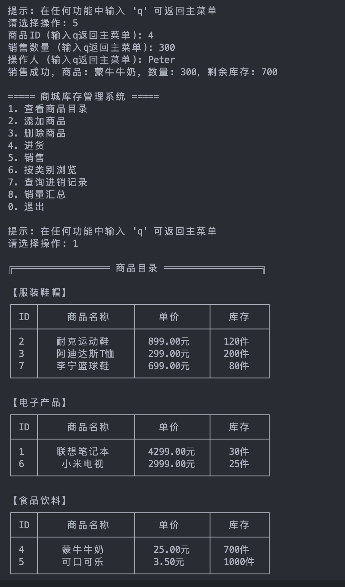
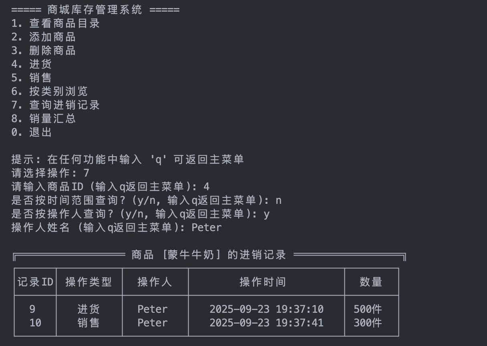
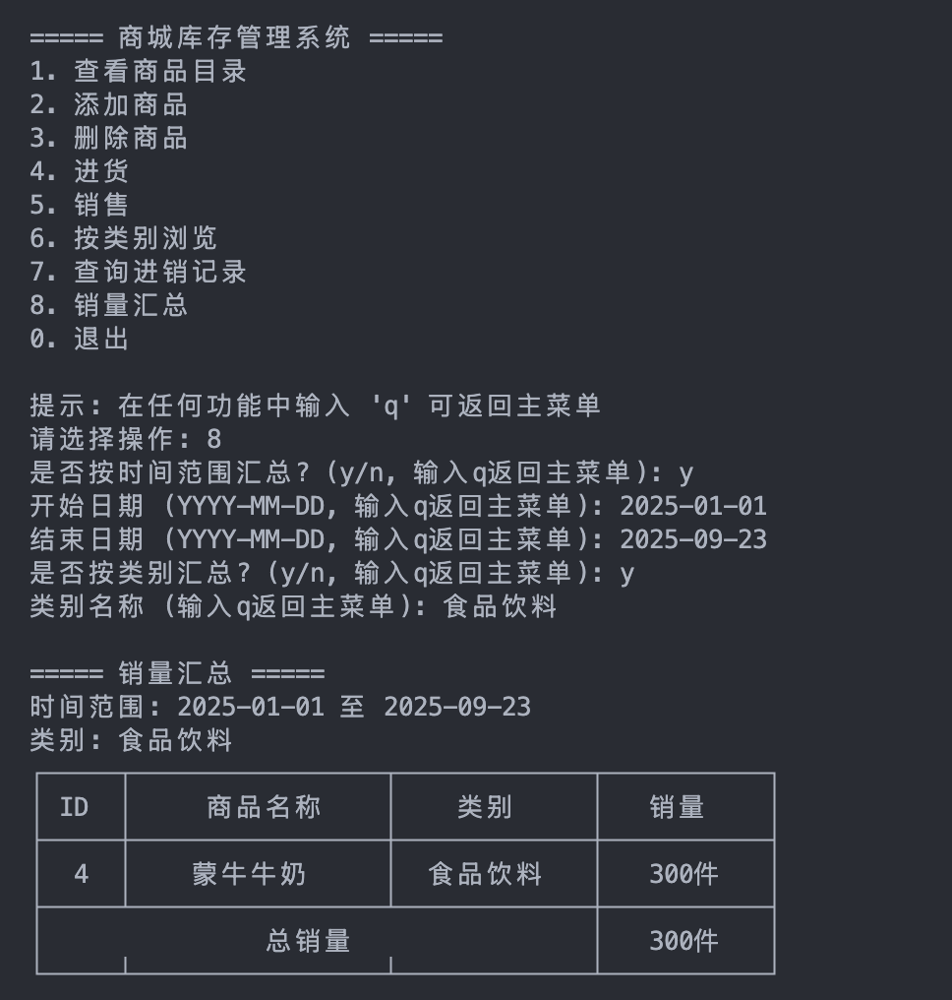
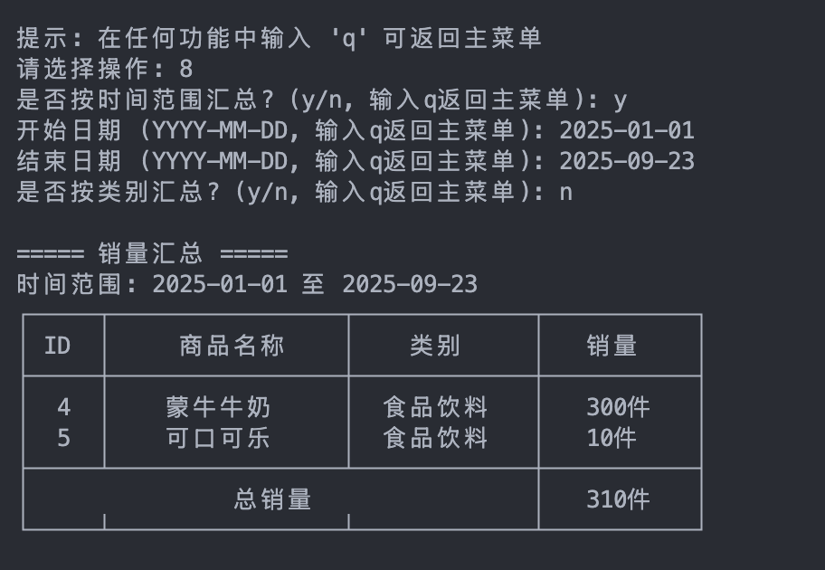

# 实验一  基于文件系统的“商城库存管理”应用系统 实验报告

#### 2023级图灵实验班 张昕跃 2023202300

----------------------------------

## 1. 实验环境（计算机配置，操作系统，编程语言，编程工具等）

### 1.1 计算机配置
- **计算机型号**: MacBook Air (M3)
- **处理器**: Apple M3 芯片 (ARM64架构)
- **内存存储**: 16GB+512GB
  
### 1.2 软件环境
- **操作系统**: macOS Sequoia 15.1 (Build 24B83)
- **内核版本**: Darwin 24.1.0
- **编程语言**: C++ (C++17标准)
- **编译器**: Apple Clang 16.0.0 (clang-1600.0.26.3)
- **编程工具**: VS Code、Claude Code

## 2. 实验结果及分析

### 2.1 数据结构设计
- **Product结构体**: 存储商品信息（ID、名称、类别、价格、库存、删除标记）
- **Transaction结构体**: 记录进销操作（记录ID、商品ID、操作类型、操作人、时间戳、数量）
- **InventoryManager类**: 核心业务逻辑管理器

### 2.2 文件存储系统
- **products.txt**: 商品信息持久化存储
- **transactions.txt**: 交易记录持久化存储
- 格式：空格分隔的文本格式，确保跨平台兼容性

### 2.3 功能模块测试结果

#### 2.3.1 商品目录查看
**输入**: 选择菜单选项1

**输出**:

**分析**: 系统成功按类别分组显示商品，表格格式规整，中文字符对齐正确。

#### 2.3.2 库存管理（进货与销售）
**输入**: 选择菜单选项4，进货5台小米电视

**输出**:

**分析**: 进货功能修改货物数量成功，记录操作人情况也成功。

#### 2.3.3 商品删除

**输入**: 选择菜单选项3，输入小米电视的id并删除。

**输出**:

**分析**: 删除小米电视商品成功。

#### 2.3.4 按类别浏览与库存排序

**输入**: 选择菜单选项6，输入类别`食品饮料`，并选择是否按照库存排序。

**输出**:

**分析**: 可以查看某类别下的所有商品，并按库存量多少排序。

#### 2.3.5 进销记录查询

**输入**: 
- 选择菜单选项4，输入商品ID为4，进货500箱蒙牛牛奶
- 选择菜单选项5，输入商品ID为4，销售300箱蒙牛牛奶

**输出**:

**分析**: 应该还剩下700箱，并且可以看到进销记录，还可以根据销售人查询

#### 2.3.4 按类别浏览与库存排序

**输入**: 选择菜单选项8，选择时间，可以额外选择类别

**输出**:

**分析**: 可以查询在一定时间范围内全部商品或某类商品的总销量

## 3. 实验总结

### 3.1 系统优势
1. **架构清晰**: 采用面向对象设计，代码结构清晰，易于维护和扩展
2. **功能完整**: 涵盖商品管理、库存操作、记录查询、数据汇总等核心功能
3. **数据持久化**: 基于文件系统的存储方案，数据安全可靠
4. **用户友好**: 命令行界面简洁明了，操作流程符合直觉
5. **中文支持**: 完美处理中文字符显示和对齐问题
6. **跨平台**: C++标准库实现，支持多种操作系统

### 3.2 技术亮点
1. **智能对齐算法**: 自动计算中文字符显示宽度，确保表格整齐
2. **时间戳记录**: 精确记录操作时间，便于审计和分析
3. **输入安全**: 全面的输入验证和错误处理

### 3.3 潜在改进方向
1. **数据库集成**: 可扩展支持SQLite或MySQL数据库
2. **网络功能**: 添加多用户并发访问支持
3. **图形界面**: 开发GUI版本提升用户体验
4. **报表功能**: 增加更丰富的统计图表
5. **权限管理**: 实现用户角色和权限控制

### 3.4 开发经验总结
本次实验成功实现了一个功能完整的商城库存管理系统，证明了C++在业务系统开发中的实用性和可靠性。系统设计考虑了实际使用场景，在数据安全、用户体验、代码质量等方面都达到了较高标准。通过这个项目，深入理解了面向对象编程、文件操作、字符串处理等核心技术在实际项目中的应用。