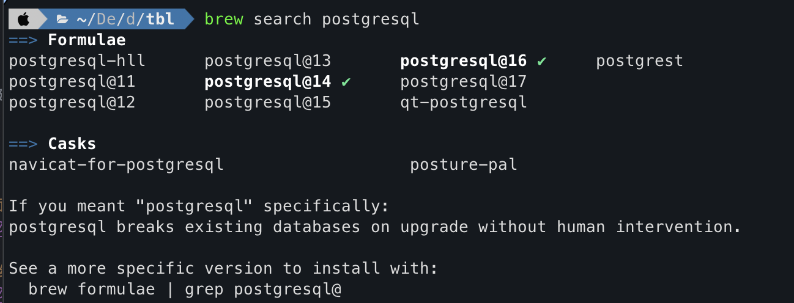
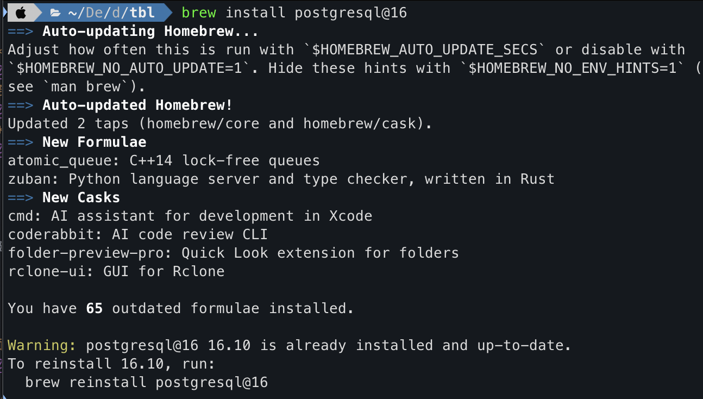
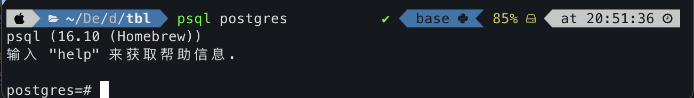
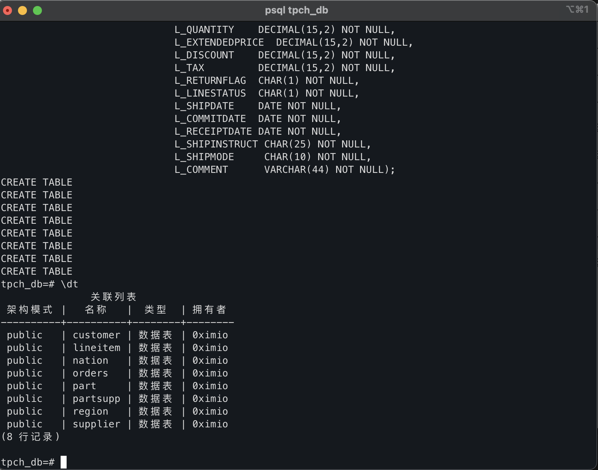
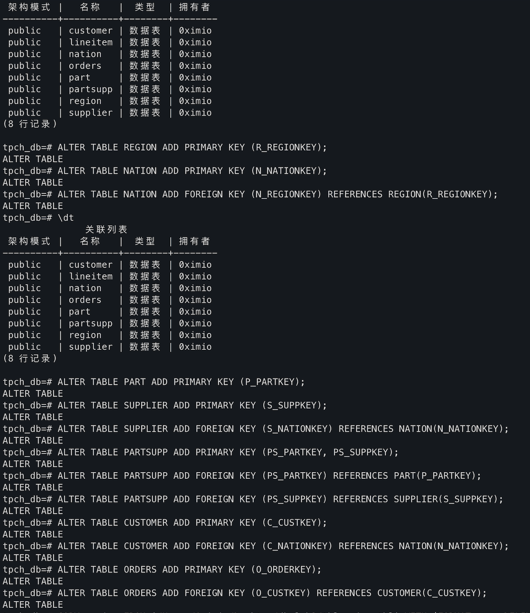
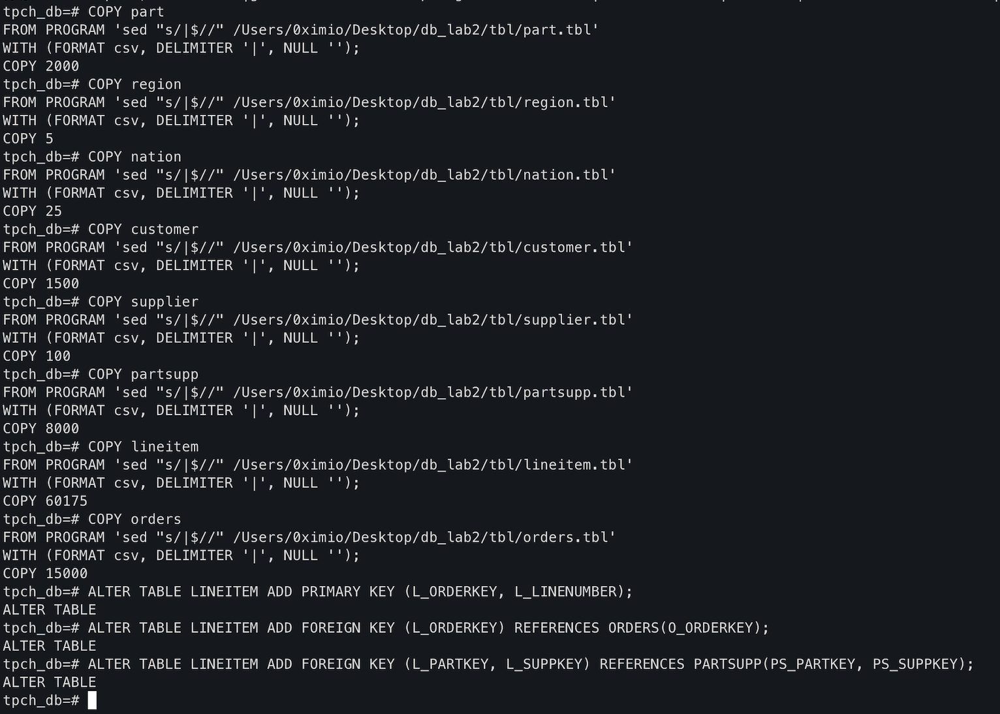
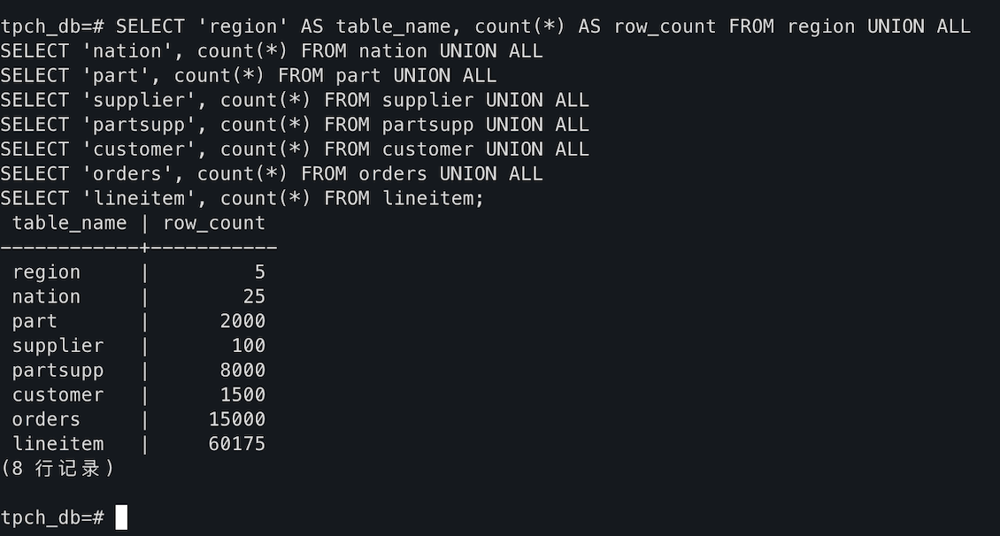
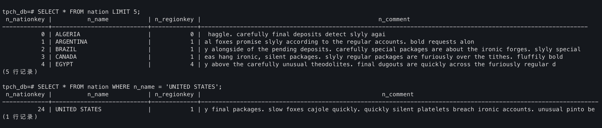
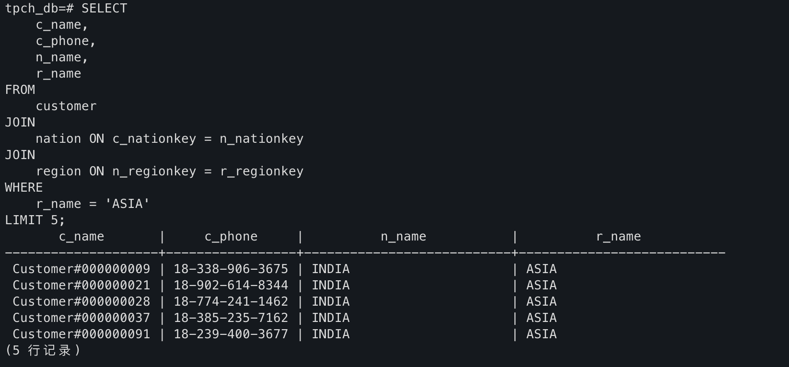
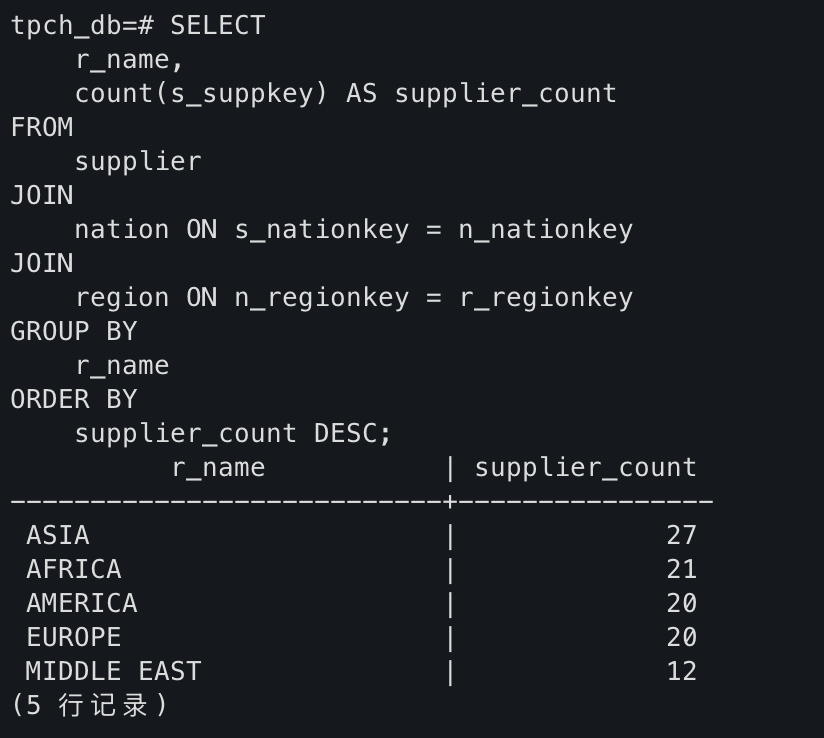

# 实验二  DBMS软件安装及数据定义、修改、导入 实验报告

#### 2023级图灵实验班 张昕跃 2023202300

----------------------------------

## 1. 实验环境（计算机配置，操作系统，编程语言，编程工具等）

*   **计算机配置**: `MacBook Air, Apple M3`
*   **操作系统**: `macOS Sequoia 15.1 (Build 24B83)`
*   **数据库管理系统 (DBMS)**: `PostgreSQL 16.1`
*   **安装与管理工具**: `Homebrew`, `Iterm`
*   **数据库客户端**: `PostgreSQL`
*   **实验数据**: `TPC-H 数据集` (Scale Factor = 0.01)

## 2. 实验结果及分析

#### **2.1 DBMS 安装过程**

本次实验通过 macOS 的包管理器 Homebrew 安装 PostgreSQL。主要步骤包括更新 Homebrew、执行安装命令以及启动数据库服务。

因为装完了才发现要三张截图emmm，只能放安装好的结果了。

*   **截图1：支持的PostgreSql版本。**
    
*   **截图2：执行 `brew install postgresql` 命令的终端界面。**
    
*   **截图3：使用 `psql postgres` 成功连接到默认数据库的界面。**
    

#### **2.2 执行DDL、DML语句**

成功连接到新建的 `tpch_db` 数据库后，首先执行了数据定义语言（DDL）语句，创建了 TPC-H 标准的 8 张数据表。

随后，执行了数据操纵语言（DML）中的 `ALTER TABLE` 语句，为各表添加了主键和外键约束，以保证数据的实体完整性和引用完整性。

*   **截图4：执行 `CREATE TABLE` 语句，成功创建 8 张表的终端界面。用`\dt` 命令的输出来验证。**
    
*   **截图5：执行 `ALTER TABLE` 语句，为各表添加主键和外键约束，终端显示 `ALTER TABLE` 成功信息。**
    

#### **2.3 数据生成与导入**

使用 PostgreSQL 提供的 `COPY` 命令从预先生成的 `.tbl` 数据文件中批量导入数据。该命令效率高，能够快速将大规模数据加载到数据库中。通过指定 `|` 为分隔符，成功将所有数据文件导入到对应的表中。

*   **截图6：在 `psql` 中执行 `\copy` 命令导入数据的过程。截图显示了表的导入命令及其返回的成功信息（如 `COPY 1500`）。**
    

#### **2.4 数据查询与验证**

数据导入完成后，进行了数据验证。首先，查询了各表的行数，结果与 TPC-H 在 SF=0.01 规模下的标准行数基本相符，证明数据导入完整。随后，执行了简单的单表查询和多表连接（JOIN）查询，均返回了预期的正确结果，表明数据库已搭建成功并可正常使用。


*   **截图7：执行查询各表行数的 SQL 语句，返回的行数量都与预期一致（对应的customer 约 1,500 行，orders 约 15,000 行，lineitem 约 60,000 行）**
    ```sql
    SELECT 'region' AS table_name, count(*) AS row_count FROM region UNION ALL
    SELECT 'nation', count(*) FROM nation UNION ALL
    SELECT 'part', count(*) FROM part UNION ALL
    SELECT 'supplier', count(*) FROM supplier UNION ALL
    SELECT 'partsupp', count(*) FROM partsupp UNION ALL
    SELECT 'customer', count(*) FROM customer UNION ALL
    SELECT 'orders', count(*) FROM orders UNION ALL
    SELECT 'lineitem', count(*) FROM lineitem;
    ```
    

*   **截图8：执行简单的 SQL 查询语句。**
    ```sql
    SELECT * FROM nation LIMIT 5;

    SELECT * FROM nation WHERE n_name = 'UNITED STATES';
    ```
    

*   **截图9、10：执行带 JOIN 的复杂查询语句。**

    ```sql
    -- 查找前 5 位来自亚洲的客户
    -- 通过 c_nationkey 将 customer 表与 nation 表关联，找到每个客户所在的国家
    -- 再通过 n_regionkey 将 nation 表与 region 表关联，找到每个国家所属的地区
    SELECT c_name, c_phone, n_name, r_name
    FROM customer
    JOIN nation ON c_nationkey = n_nationkey
    JOIN region ON n_regionkey = r_regionkey
    WHERE r_name = 'ASIA'
    LIMIT 5;
    ```
    

    ``` sql
    -- 统计每个地区的供应商数量
    -- join 将每个 supplier 与 nation 和 region 关联起来
    -- groupby 将所有来自同一 r_name 的供应商记录分组，降序排列结果
    SELECT r_name, count(s_suppkey) AS supplier_count
    FROM supplier
    JOIN nation ON s_nationkey = n_nationkey
    JOIN region ON n_regionkey = r_regionkey
    GROUP BY r_name
    ORDER BY supplier_count DESC;
    ```

    

### **3. 实验总结**

本次实验通过在 macOS 上安装配置 PostgreSQL，掌握了 DBMS 的基本搭建方法。

实验中，我亲手执行了 DDL 语句来构建 TPC-H 数据模型，并使用 `ALTER TABLE` 添加主外键约束，深刻理解了数据完整性在数据库设计中的重要性。

使用 `COPY` 命令批量导入数据的过程，让我体验了真实场景下的数据加载操作。

最后，通过编写并执行从简单到复杂的多表连接 SQL 查询，验证了数据库的正确性，并巩固了 SQL 查询技能。