# 实验三 SQL查询

#### 2023级图灵实验班 张昕跃 2023202300

----------------------------------

## 1. 实验环境（计算机配置，操作系统，编程语言，编程工具等）

*   **计算机配置**: `MacBook Air, Apple M3`
*   **操作系统**: `macOS Sequoia 15.1 (Build 24B83)`
*   **数据库管理系统 (DBMS)**: `PostgreSQL 16.1`
*   **实验数据**: `TPC-H 数据集` (Scale Factor = 0.01)

## 2. 实验结果及分析

### 2.1 单表查询

> 这里对于比较简单的题目就不写过程了

#### 1. 查询PART表中所有品牌名称以"BRAND"开头且类型包含"POLISHED"的商品，按商品尺寸降序排列。
- **SQL**：
```sql
SELECT *
FROM part
WHERE p_brand LIKE 'Brand%' AND p_type LIKE '%POLISHED%'
ORDER BY p_size DESC;
```
> 这里原题目似乎有笔误，因为数据库里都是以Brand开头的，以BRAND全大写什么也搜索不出来
- **运行截图**：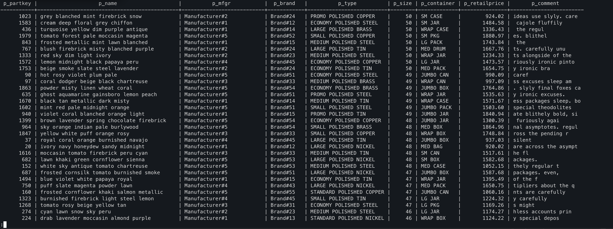

#### 2. 统计CUSTOMER表中每个市场区域(MKTSEGMENT)的客户数量。
- **SQL**：
```sql
SELECT c_mktsegment, COUNT(*) AS customer_count
FROM customer
GROUP BY c_mktsegment;
```
- **运行截图**：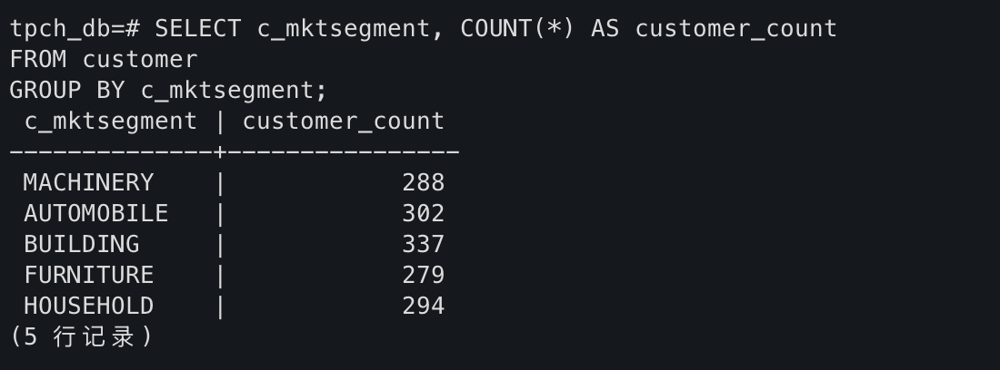

#### 3. 查询SUPPLIER表中，账户余额(ACCTBAL)平均值大于9000的国家(NATIONKEY)及其平均余额。
- **SQL**：
```sql
SELECT s_nationkey, AVG(s_acctbal) AS avg_balance
FROM supplier
GROUP BY s_nationkey
HAVING AVG(s_acctbal) > 9000;
```
> 由于没有账户余额均值大于9000，所以这里是空的
- **运行截图**：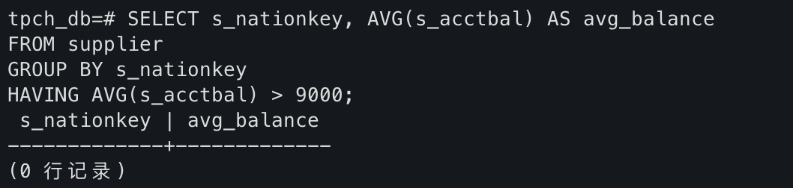

#### 4. 查询ORDERS表中订单总金额(TOTALPRICE)最高的前10笔订单信息。
- **SQL**：
```sql
SELECT *
FROM orders
ORDER BY o_totalprice DESC
LIMIT 10;
```
- **运行截图**：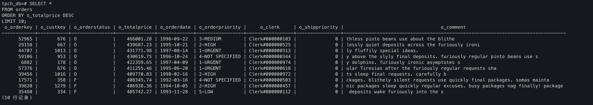

#### 5. 查询LINEITEM表中每条订单明细的实际金额（扩展价格×(1-折扣)），并显示订单号、商品号和实际金额。
- **SQL**：
```sql
SELECT
    l_orderkey,
    l_partkey,
    l_extendedprice * (1 - l_discount) AS actual_price
FROM lineitem;
```
- **运行截图**：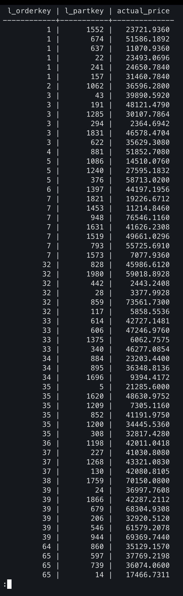

#### 6. 统计PART表中包装类型(CONTAINER)以"SM"开头的各类包装的商品数量。
- **SQL**：
```sql
SELECT p_container, COUNT(*) AS p_counts
FROM part
WHERE p_container LIKE 'SM%'
GROUP BY p_container;
```
- **运行截图**：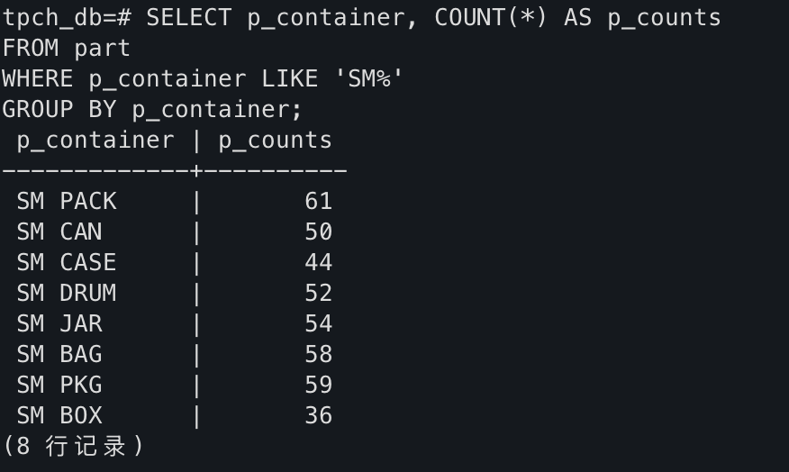

#### 7. 查询LINEITEM表中，发货模式(SHIPMODE)为"AIR"或"TRUCK"，且平均数量大于25的发货模式。
- **SQL**：
```sql
SELECT l_shipmode, AVG(l_quantity) AS avg_quantity
FROM lineitem
WHERE l_shipmode IN ('AIR', 'TRUCK')
GROUP BY l_shipmode
HAVING AVG(l_quantity) > 25;
```
- **运行截图**：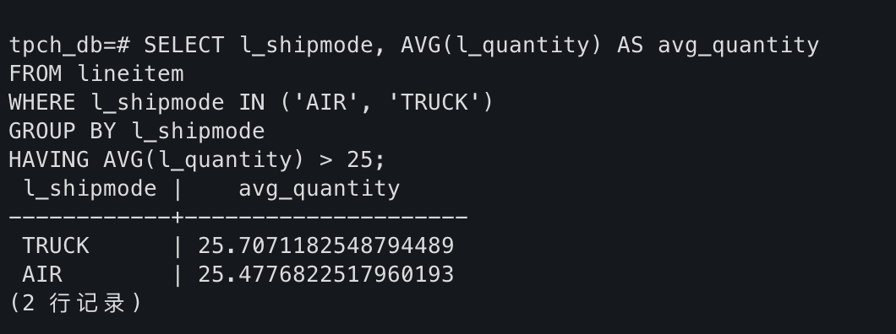

#### 8. 查询CUSTOMER表，计算每个客户的折扣余额（账户余额×0.9），并按折扣余额降序排列。
- **SQL**：
```sql
SELECT
    c_custkey,
    c_name,
    c_acctbal,
    c_acctbal * 0.9 AS discounted_balance
FROM customer
ORDER BY discounted_balance DESC;
```
- **运行截图**：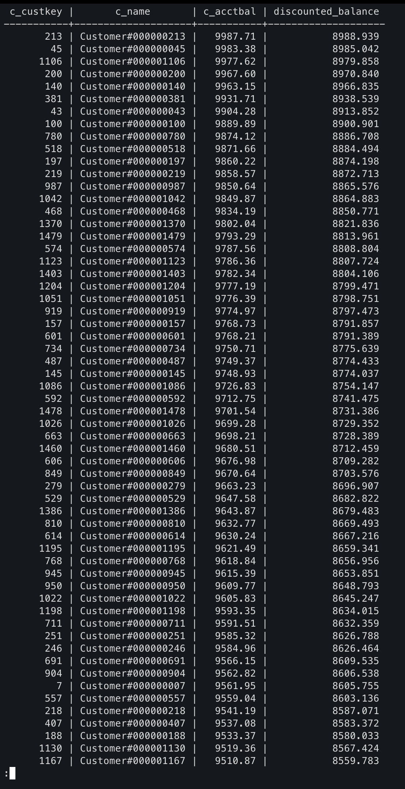

#### 9. 查询SUPPLIER表中，电话号码以"15"开头的供应商，按国家分组后，筛选出供应商数量超过5个的国家。
- **SQL**：
```sql
SELECT s_nationkey, COUNT(*) AS supplier_count
FROM supplier
WHERE s_phone LIKE '15%'
GROUP BY s_nationkey
HAVING COUNT(*) > 5;
```
> 这里为了看看是不是真的没有，我查了发现以15开头的供应商就只有3个，因此不管怎么分都不会有超过五个的国家。
> 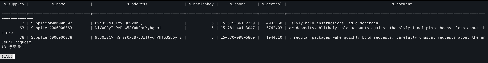
- **运行截图**：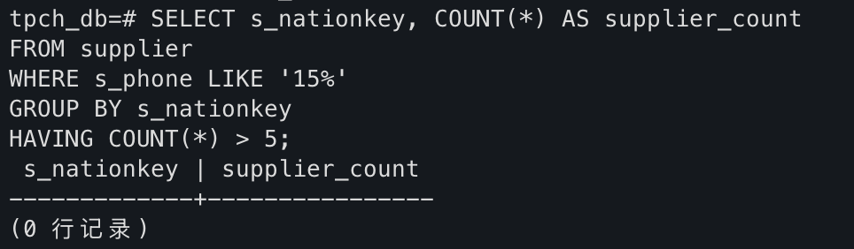

#### 10. 查询ORDERS表中订单优先级(PRIORITY)包含"URGENT"的订单，按订单日期升序、总金额降序排列，显示前15条。
- **SQL**：
```sql
SELECT *
FROM orders
WHERE o_orderpriority LIKE '%URGENT%'
ORDER BY o_orderdate ASC, o_totalprice DESC
LIMIT 15;
```
- **运行截图**：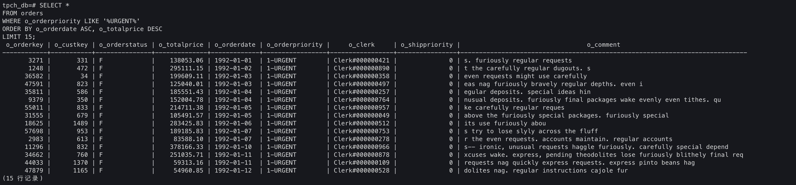

#### 11. 查询PART表，找出品牌名称第二个字符为大写字母"R"，且制造商名称以"Manufacturer"开头的商品，计算每个尺寸组的平均零售价。
- **SQL**：
```sql
SELECT p_size, AVG(p_retailprice) AS avg_retailprice
FROM part
WHERE p_mfgr LIKE 'Manufacturer%' AND p_brand LIKE '_R%'
-- AND p_brand LIKE '_R%' 是无结果的
GROUP BY p_size
ORDER BY p_size;
-- 加上ORDER BY便于查看
```
> 这里似乎也是笔误，查询大写R就是无结果的:
> 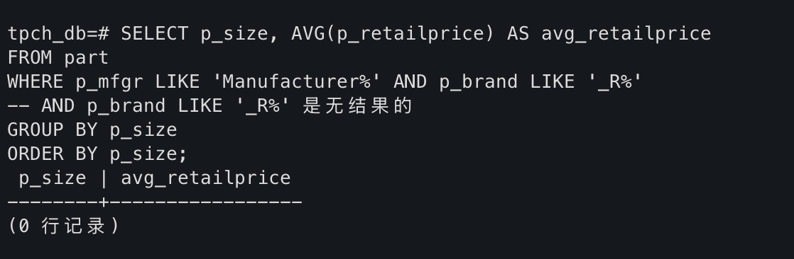
- **运行截图**：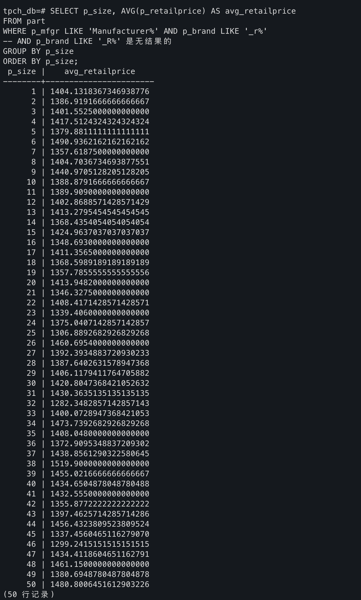

#### 12. 查询LINEITEM表，统计1995-1996年间每个季度的订单明细数量，只显示数量超过1000的季度。
- **SQL**：
```sql
SELECT
    EXTRACT(YEAR FROM l_shipdate) AS year,
    EXTRACT(QUARTER FROM l_shipdate) AS quarter,
    COUNT(*) AS item_count
FROM lineitem
WHERE l_shipdate BETWEEN DATE '1995-01-01' AND DATE '1996-12-31'
GROUP BY year, quarter
HAVING COUNT(*) > 1000
ORDER BY year, quarter;
```
- **运行截图**：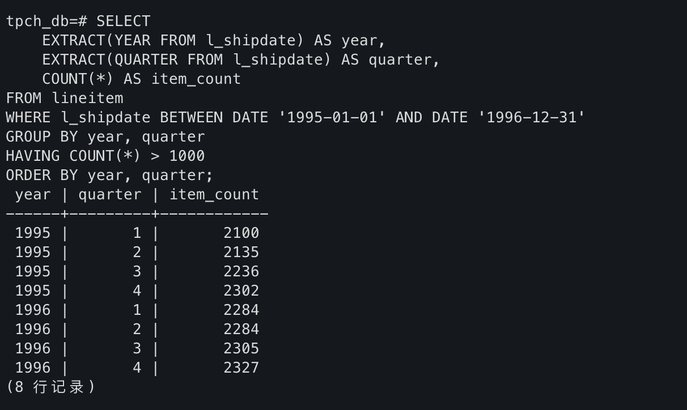

### 2.2 多表查询

#### 1.	查询每个国家(NATION)的客户数量，显示国家名称和客户数量。
- **SQL**：
```sql
SELECT n_name, COUNT(*) AS customer_count
from customer c, nation n
where c.c_nationkey = n.n_nationkey
GROUP BY n_name
ORDER BY customer_count DESC;

SELECT n_name, COUNT(c.c_custkey) AS customer_count
FROM nation n
JOIN customer c ON n.n_nationkey = c.c_nationkey
GROUP BY n_name
ORDER BY customer_count DESC;
```
> 用 where+ =拼接 和 JOIN 都可以，后面我大多用JOIN
- **运行截图**：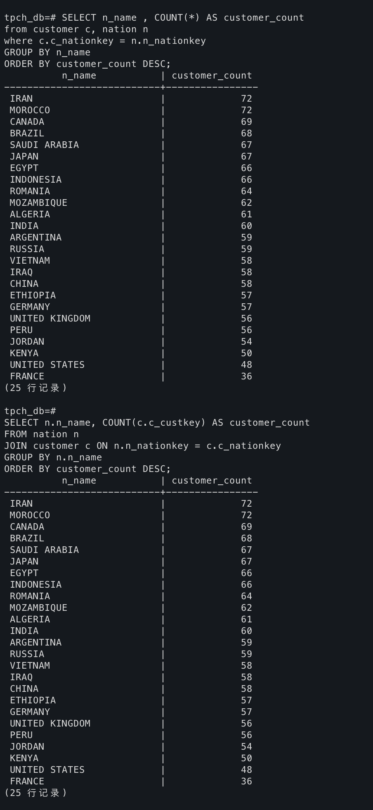

#### 2. 查询每个地区(REGION)的供应商数量，显示地区名称和供应商数量
- **SQL**：
```sql
SELECT r.r_name AS region_name, COUNT(s.s_suppkey) AS supplier_count
FROM supplier s
JOIN nation n ON n.n_nationkey = s.s_nationkey
JOIN region r ON r.r_regionkey = n.n_regionkey
GROUP BY r.r_name;
```
- **运行截图**：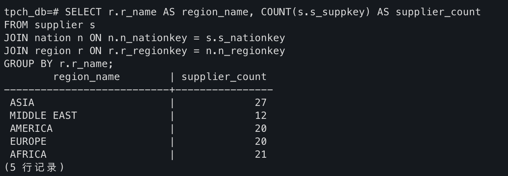

#### 3. 查询单个订单总金额超过10000的客户名称及其订单总金额。
- **SQL**：
```sql
SELECT c.c_name AS customer_name, o.o_totalprice AS total_amount
FROM customer c
JOIN orders o ON c.c_custkey = o.o_custkey
WHERE o.o_totalprice > 10000
ORDER BY o.o_totalprice DESC;
```
> 这里其实表述不是很清楚，订单总金额指的是单个订单还是这个客户的所有订单呢，如果是所有订单就要像下面这样写了
> 不过我们暂且还是理解成单个
> ``` sql
> SELECT c.c_name AS customer_name, SUM(o.o_totalprice) AS total_amount
> FROM customer c
> JOIN orders o ON c.c_custkey = o.o_custkey
> GROUP BY c.c_name
> HAVING SUM(o.o_totalprice) > 10000
> ORDER BY SUM(o.o_totalprice) DESC;
> ```
- **运行截图**：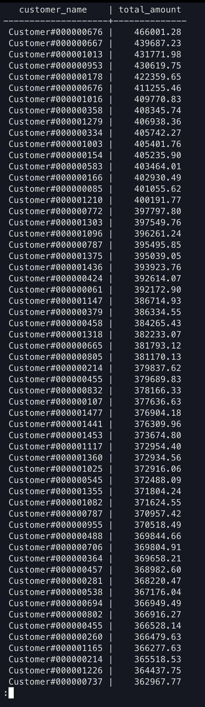

#### 4. 查询至少有一个订单的客户信息。
- **SQL**：
```sql
SELECT c.*
FROM customer c
WHERE EXISTS (
    SELECT 1 
    FROM orders o 
    WHERE o.o_custkey = c.c_custkey
);

-- Use join
SELECT DISTINCT c.*
FROM customer c
JOIN orders o ON c.c_custkey = o.o_custkey
ORDER BY c.c_custkey;
```
> 直接思路是直接从customer表中选然后一个个判断有订单还是没有
> 当然也可以直接把customer表和orders表 JOIN 起来，会自动过滤掉没有订单的
> 不过这里每个客户可能有多个订单，因此加一个 DISTINCT 去重
- **运行截图**：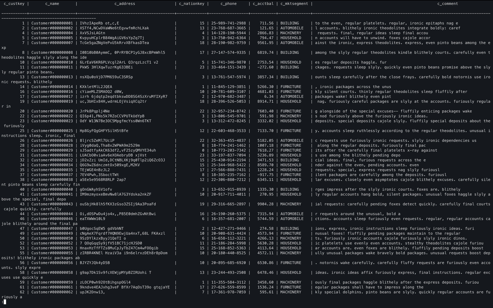

#### 5. 查询每个国家的平均客户账户余额，结果显示国家名称和平均客户账户余额。
- **SQL**：
```sql
SELECT n.n_name AS nation_name, AVG(c.c_acctbal) AS avg_acctbal
FROM customer c
JOIN nation n ON c.c_nationkey = n.n_nationkey
GROUP BY n.n_name;
```
- **结果分析**：展示不同国家客户的账户余额水平，便于制定分区域信贷策略。
- **运行截图**：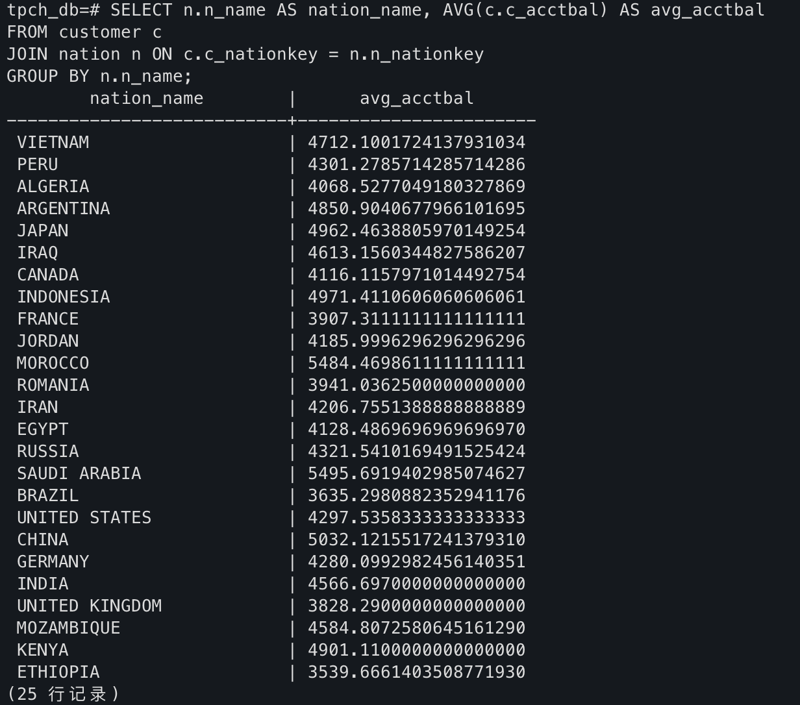

#### 6. 查询没有下过任何订单的客户信息。
- **SQL**：
```sql
SELECT c.*
FROM customer c
WHERE NOT EXISTS (
    SELECT 1 
    FROM orders o 
    WHERE o.o_custkey = c.c_custkey
)
ORDER BY c.c_custkey;

-- Use join
SELECT c.*
FROM customer c
LEFT JOIN orders o ON c.c_custkey = o.o_custkey
WHERE o.o_orderkey IS NULL
ORDER BY c.c_custkey;
```
> 也是两种方法，把第四题反一下就好。 
- **结果分析**：`LEFT JOIN` 搭配空值过滤识别沉默客户，为营销唤醒提供目标客户名单。
- **运行截图**：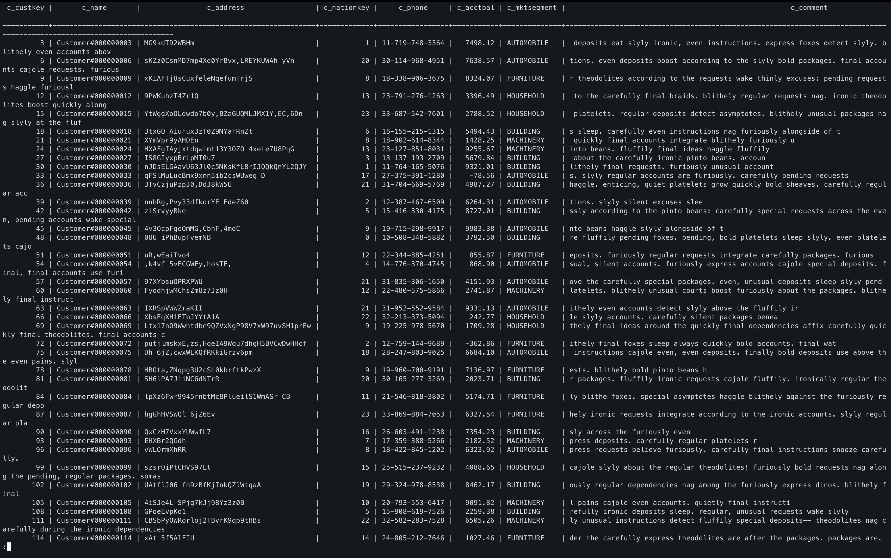

#### 7. 查询在同一国家的客户对（不重复组合）。
- **SQL**：
```sql
SELECT c1.c_name AS customer1, c2.c_name AS customer2, n.n_name AS nation_name
FROM customer c1
JOIN customer c2 ON c1.c_nationkey = c2.c_nationkey AND c1.c_custkey < c2.c_custkey
JOIN nation n ON c1.c_nationkey = n.n_nationkey;
```
- **结果分析**：通过自连接并限制主键大小关系避免重复组合，生成同国客户配对清单。
- **运行截图**：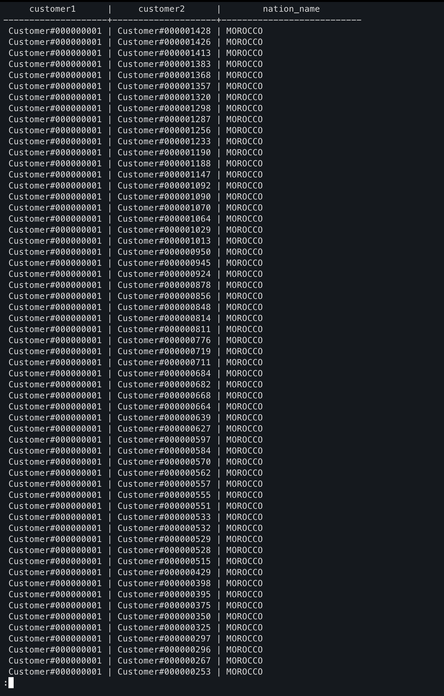

#### 8. 查询订单总金额超过该客户平均订单金额的订单信息。
- **SQL**：
```sql
SELECT o.*
FROM orders o
JOIN (
    SELECT o_custkey, AVG(o_totalprice) AS avg_order_amount
    FROM orders
    GROUP BY o_custkey
) cust_avg ON o.o_custkey = cust_avg.o_custkey
WHERE o.o_totalprice > cust_avg.avg_order_amount;
```
> 先用子查询查出每个用户的平均订单金额
> 然后拼到每个用户上再select
- **运行截图**：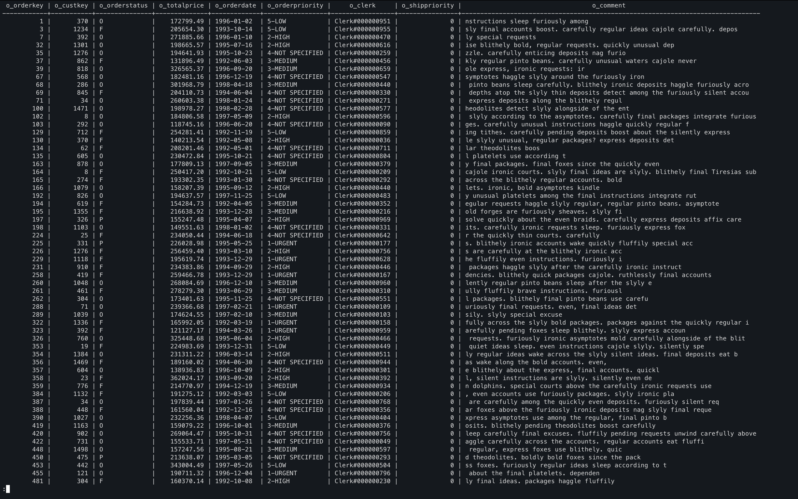

#### 9. 查询供应了所有类型商品的供应商信息。
- **SQL**：
```sql
SELECT s.*
FROM supplier s
WHERE NOT EXISTS (
    -- 找出供应商s没有供应的零件
    SELECT p.p_type
    FROM part p
    -- 不存在找不到该记录
    WHERE NOT EXISTS (
        -- 找出 partsupp 供应关系表中，属于供应商 s，对应零件 p 的那条供应记录。
        -- 即确认供应商 s 是否供应了零件 p
        SELECT 1
        FROM partsupp ps
        WHERE ps.ps_suppkey = s.s_suppkey AND ps.ps_partkey = p.p_partkey
    )
);

-- 使用HAVING
SELECT s.*
-- 直接全拼到供应商表上
-- 看供应商表提供的独特商品p个数和总表个数一样不一样就可以了
FROM supplier s
JOIN partsupp ps ON s.s_suppkey = ps.ps_suppkey
JOIN part p ON ps.ps_partkey = p.p_partkey
GROUP BY s.s_suppkey, s.s_name, s.s_address, s.s_nationkey, s.s_phone, s.s_acctbal, s.s_comment
HAVING COUNT(DISTINCT p.p_type) = (SELECT COUNT(DISTINCT p_type) FROM part);
```
> 两个 NOT EXIST 这个逻辑确实有点绕，难想出来...
> 具体解释看注释
> 值得一提的是这里没有供应商供应了所有商品。
- **运行截图**：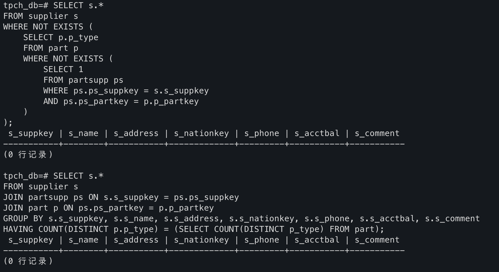

#### 10. 查询总价大于所处月份平均总价的订单。
- **SQL**：
```sql
-- Solution1:
-- 遍历 orders 表的每一行，对于每一行：
-- 查看该订单的年份和月份。
-- 找到所有与它同年同月的其他订单（即它所在的分区）。
-- 计算这个分区内所有订单的 o_totalprice 的平均值。
-- 将这个算出的平均值作为新的一列 avg_monthly_price 附加到当前行上。
WITH MonthlyAvg AS (
    SELECT
        *,
        -- 2. 添加一个计算出的新列
        --  关键字 OVER 表明这是一个窗口函数，它不会像 GROUP BY 那样把多行压缩成一行，而是在保持原有行数不变的情况下，为每一行计算一个附加值。
        AVG(o_totalprice) OVER (PARTITION BY EXTRACT(YEAR FROM o_orderdate), EXTRACT(MONTH FROM o_orderdate)) AS avg_monthly_price
    FROM
        orders
)
SELECT MonthlyAvg.o_orderkey, o_totalprice, avg_monthly_price 
FROM MonthlyAvg
WHERE o_totalprice > avg_monthly_price
ORDER BY o_orderkey;

-- Solution2:
SELECT o.*
FROM orders o
JOIN (
  -- 求每个年/月的平均总价
    SELECT 
        EXTRACT(YEAR FROM o_orderdate) AS order_year,
        EXTRACT(MONTH FROM o_orderdate) AS order_month,
        AVG(o_totalprice) AS monthly_avg
    FROM orders
    GROUP BY EXTRACT(YEAR FROM o_orderdate), EXTRACT(MONTH FROM o_orderdate)
) monthly_avg ON EXTRACT(YEAR FROM o.o_orderdate) = monthly_avg.order_year 
               AND EXTRACT(MONTH FROM o.o_orderdate) = monthly_avg.order_month
WHERE o.o_totalprice > monthly_avg.monthly_avg;
```
> AI直接上了WITH这个没学过的语法...
> 第二种虽然看着烦但是容易理解一点
- **运行截图**：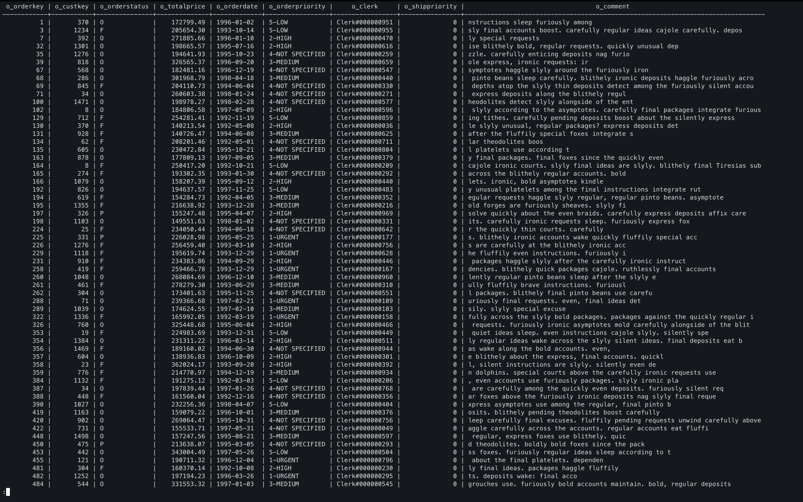

## 3. 实验总结

本实验系统梳理了 TPC-H 数据集上的单表与多表查询场景，熟练运用了分组、连接与窗口函数等 SQL 方法。通过逐条验证运行结果，进一步理解了筛选条件与数据特征之间的关系，为后续复杂查询与性能调优奠定了实践基础。

总的来说，还是需要练一练的，尤其是多表查询还是有很难的自己没法写出来的题目，需要寻求AI的帮助...