# 实验四 安全性和完整性

#### 2023级图灵实验班 张昕跃 2023202300

----------------------------------

## 1. 实验环境

* **计算机配置**: `MacBook Air, Apple M3`
* **操作系统**: `macOS Sequoia 15.1 (Build 24B83)`
* **数据库管理系统 (DBMS)**: `PostgreSQL 16.1`
* **实验数据**: `TPCH 数据集` (Scale Factor = 0.01)
> sql代码实现在`sql/`文件夹中

## 2. 实验内容与结果分析

### 2.1 安全性实验

#### 2.1.1 教材示例复现

按照`sql/scripts.sql`的脚本准备三个示例用户,demo schema及 `demo.sec_example` 测试表，随后授予登录、模式使用与 `SELECT` 权限。

通过切换账号（`\c - user_a`）验证用户A拥有Select权限；撤销权限 (`REVOKE SELECT...`) 后，再次查询即返回权限不足，说明基本授权与回收流程正常。

同时我们切换到`user_b`也是没有select权限的，测试成功。

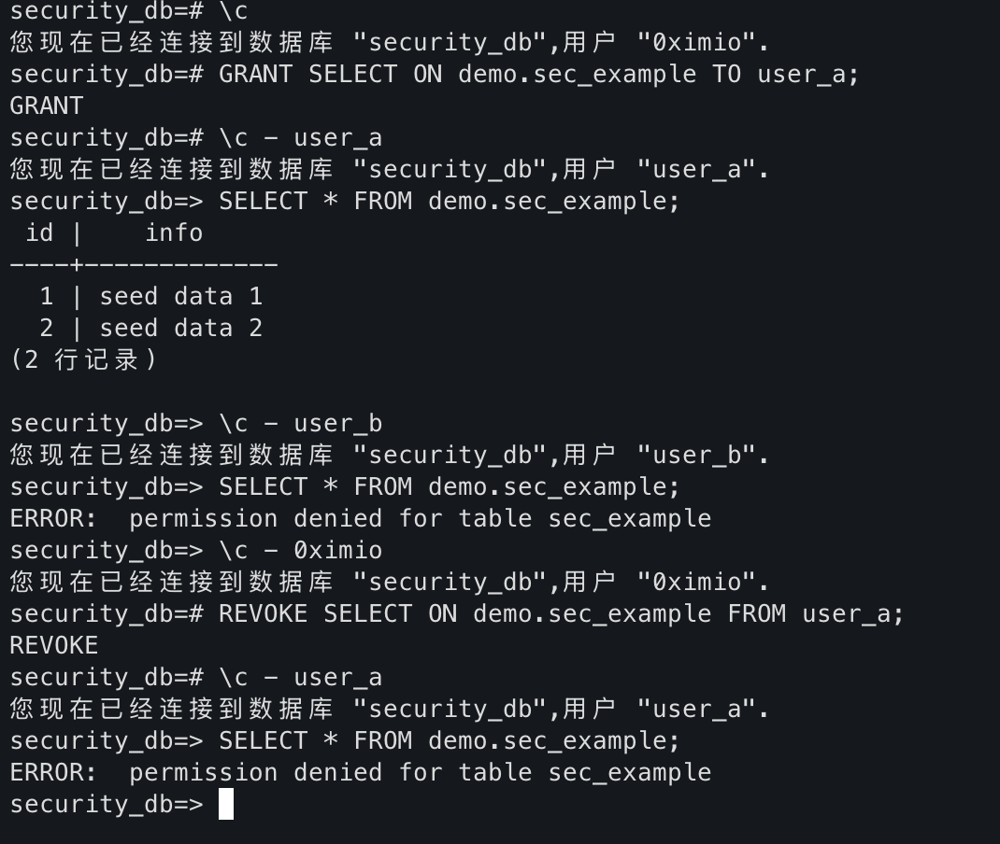

#### 2.1.2 权限传递与回收链路

脚本 `sql/security_lab4.sql:40` 起模拟场景：

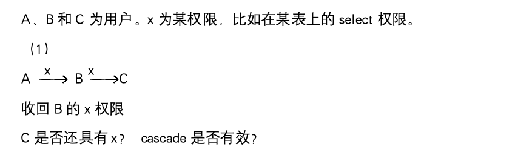

- **链式授权失效**：A→B→C 的授权体系在对 B 执行 `REVOKE ... CASCADE` 后，C 的权限被一并回收，验证了依赖链生效。
> 这里如果不加`CASCADE`参数会拒绝掉REVOKE功能，具体代码和运行结果如下：
``` sql
-- 2.1 场景一：A -> B -> C
GRANT SELECT ON demo.sec_example TO user_a WITH GRANT OPTION;
SET ROLE user_a;
GRANT SELECT ON demo.sec_example TO user_b WITH GRANT OPTION;
SET ROLE user_b;
GRANT SELECT ON demo.sec_example TO user_c WITH GRANT OPTION;
-- 切换回 A
SET ROLE user_a;

-- 回收 B 的权限并检查 C
REVOKE SELECT ON demo.sec_example FROM user_b;
-- 有依赖，报错
REVOKE SELECT ON demo.sec_example FROM user_b CASCADE;
-- 预期：C 的权限被回收
SET ROLE user_c;
-- 尝试访问，预期失败
SELECT * FROM demo.sec_example;
-- 切换回 A 检查
SET ROLE user_a;
SELECT * FROM demo.sec_example;
```
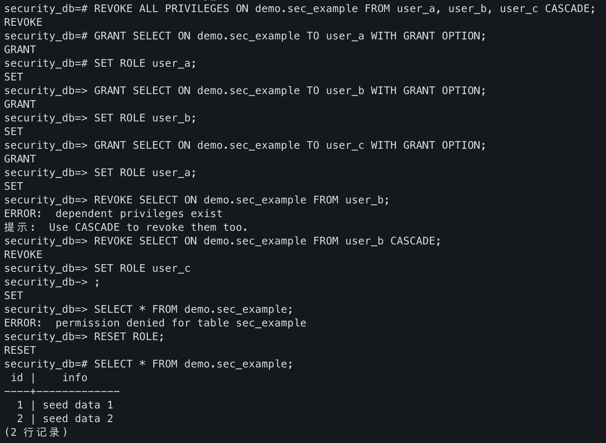

- **多源授权**：A 同时授权 B、C，且 B 继续转授给 C 。
- 当回收 B 的授权时，C 仍因直接获授而保留访问权，说明 PostgreSQL 会追踪权限来源。
> 具体代码和运行结果如下：
``` sql
-- 2.2 场景二：A 同时授权 B、C
GRANT SELECT ON demo.sec_example TO user_b WITH GRANT OPTION;
GRANT SELECT ON demo.sec_example TO user_c WITH GRANT OPTION;

-- B 再次转授给 C，形成多源权限
SET ROLE user_b;
GRANT SELECT ON demo.sec_example TO user_c WITH GRANT OPTION;
RESET ROLE;

-- 回收 B 的权限后，C 仍保留由 A 直接授予的权限
```
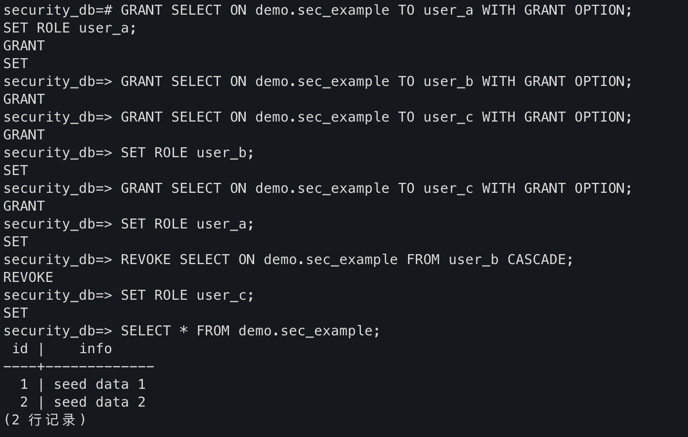

同时，也可以指定对应的权限来源来回收权限（通过普通 `REVOKE` 即可回收 C 的权限；如需针对特定 grantor，可改用 `REVOKE ... GRANTED BY` 语法。）
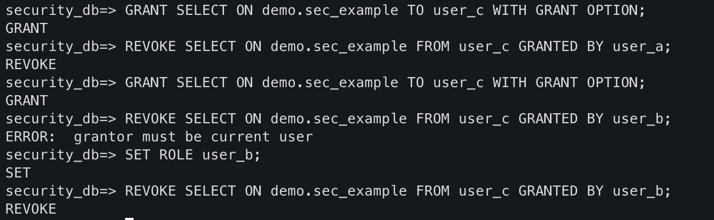

- **原因分析**：PG记录了权限的来源，允许独立授权和独立收回，即维护了一张权限表。
借助 `information_schema.role_table_grants` 可以观察授权链变化：
``` sql
  SELECT
      grantee,                -- 被授予者
      grantor,                -- 授予者
      table_schema,
      table_name,
      privilege_type,
      is_grantable            -- 是否带 WITH GRANT OPTION
  FROM information_schema.role_table_grants
  WHERE table_schema = 'demo'
    AND table_name   = 'sec_example'
  ORDER BY grantee, privilege_type;
```

我们可以发现user_a和user_b分别给user_c授予权限，因此在一个role下撤销掉，c仍然会保留权限。

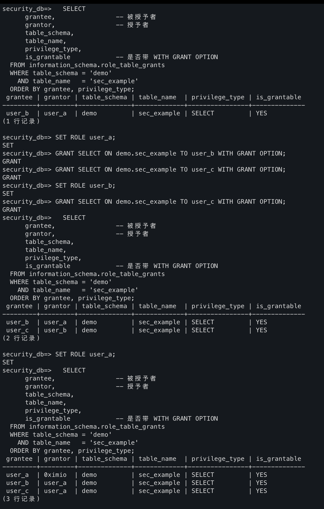

#### 2.1.3 TPCH 业务角色设计

定义三个业务角色，并授予匹配的表级权限。`DO` 代码块用于一次性为高级分析师角色开放所有数据表的只读权限。创建测试用户后，将各角色绑定。
具体代码如下，这里用了循环来防止写很多GRANT语句：
``` sql
-- 创建角色
CREATE ROLE supplier_mgr_role;
CREATE ROLE sales_mgr_role;
CREATE ROLE senior_analyst_role;

-- 授予角色所需权限
GRANT SELECT, UPDATE ON supplier TO supplier_mgr_role;
GRANT SELECT ON partsupp, part TO supplier_mgr_role;
GRANT SELECT ON nation, region TO supplier_mgr_role;

GRANT SELECT, UPDATE ON customer TO sales_mgr_role;
GRANT SELECT, INSERT, UPDATE ON orders TO sales_mgr_role;
GRANT SELECT ON lineitem TO sales_mgr_role;
GRANT SELECT ON nation TO sales_mgr_role;

DO $$
-- 声明一个名为 tbl 的变量，类型为 RECORD，用于接收循环里查询出的每一行。
DECLARE
    tbl RECORD;
-- 通过for循环拼接表省去对于每一张表写一个GRANT 
BEGIN
    FOR tbl IN SELECT tablename FROM pg_tables WHERE schemaname = 'public' LOOP
        EXECUTE format('GRANT SELECT ON TABLE public.%I TO senior_analyst_role', tbl.tablename);
    END LOOP;
END$$;

-- 创建测试用户并分配角色
CREATE USER supplier_mgr_user WITH PASSWORD 'supplier_pwd';
CREATE USER sales_mgr_user     WITH PASSWORD 'sales_pwd';
CREATE USER analyst_user       WITH PASSWORD 'analyst_pwd';

GRANT supplier_mgr_role TO supplier_mgr_user;
GRANT sales_mgr_role TO sales_mgr_user;
GRANT senior_analyst_role TO analyst_user;
```

验证三个角色：
1. `supplier_mgr_user`: 拥有 supplier 查看/更新、partsupp/part/nation/region 查询权限，其他越界权限会ERROR。

``` sql
-- Supplier Manager：拥有 supplier 更新、partsupp/part/nation/region 查询权限
SET ROLE supplier_mgr_user;
SELECT s_name FROM supplier LIMIT 1;
-- 预期：返回 1 行，说明具备 SELECT 能力（UPDATE 同时隐含 SELECT）

UPDATE supplier SET s_name = s_name WHERE s_suppkey = 1;
-- 预期：UPDATE 1，证明 UPDATE 权限生效

SELECT COUNT(*) FROM customer;
-- 预期：ERROR:  permission denied for table customer（未授予访问客户信息）

DELETE FROM supplier WHERE s_suppkey = 1;
-- 预期：ERROR:  permission denied for table supplier（未授予 DELETE）
```

结果如下，和预期一致：
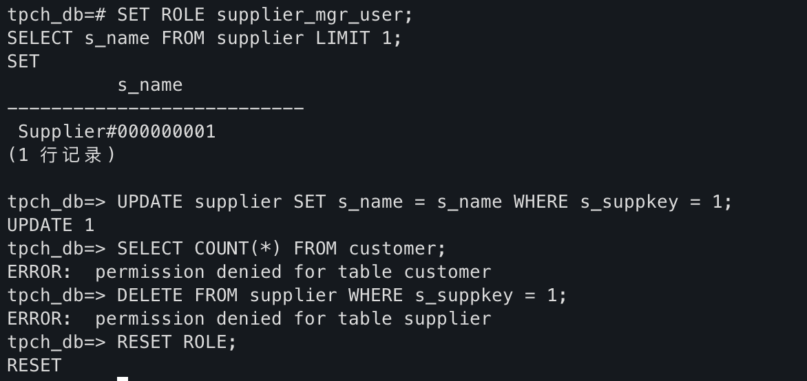

1. `sales_mgr_user`: 允许查看更新订单/客户/明细等等，禁写供应商
``` sql
-- Sales Manager：
SET ROLE sales_mgr_user;

UPDATE orders SET o_totalprice = o_totalprice WHERE o_orderkey = 1;
-- 预期：UPDATE 1，确认对 orders 的 UPDATE 权限

BEGIN;
INSERT INTO orders (
    o_orderkey, o_custkey, o_orderstatus, o_totalprice, o_orderdate,
    o_orderpriority, o_clerk, o_shippriority, o_comment
) VALUES (
    900000,
    (SELECT c_custkey FROM customer LIMIT 1),
    'O',
    0.00,
    CURRENT_DATE,
    '5-LOW',
    'Clerk#000000001',
    0,
    'lab4 permission test'
);
-- 预期：INSERT 0 1，证明具备 INSERT 权限
-- 回滚避免脏数据
ROLLBACK;

UPDATE supplier SET s_name = s_name WHERE s_suppkey = 1;
-- 预期：ERROR:  permission denied for table supplier（销售经理无法维护供应商）
```

结果如下，和预期一致：
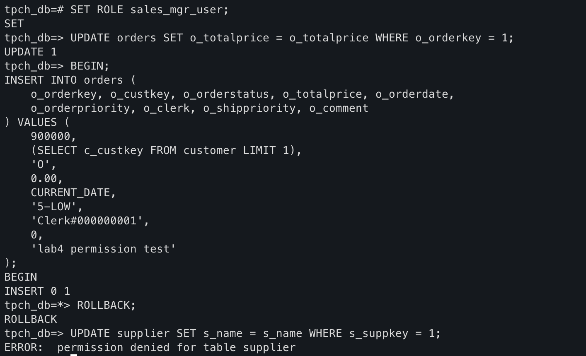


3. `analyst_user` 对所有表拥有 `SELECT` 能力，但无法执行更新等DML操作。
``` sql
-- Senior Analyst：只读全库
SET ROLE analyst_user;
SELECT COUNT(*) FROM nation;
-- 预期：成功返回计数，具备全库只读权限
UPDATE orders SET o_totalprice = o_totalprice WHERE o_orderkey = 1;
-- 预期：ERROR:  permission denied for table orders（无写入权限）

RESET ROLE;

```
结果如下，和预期一致：
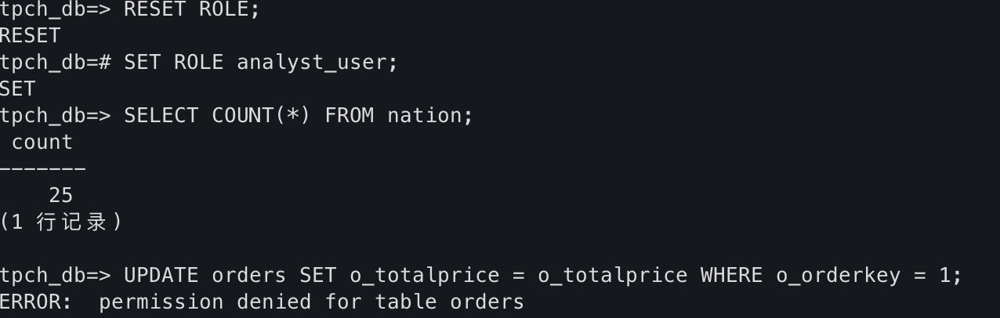

4. 补充说明
> 我们也可以通过以下代码直接查看角色授权链信息看看权限设置的对不对
``` sql
SELECT
    grantee,
    grantor,
    table_schema,
    table_name,
    privilege_type,
    is_grantable
FROM information_schema.role_table_grants
WHERE grantee IN ('supplier_mgr_role', 'sales_mgr_role', 'senior_analyst_role')
  AND table_schema IN ('public', 'demo')
ORDER BY grantee, table_name, privilege_type;
```

结果如下：
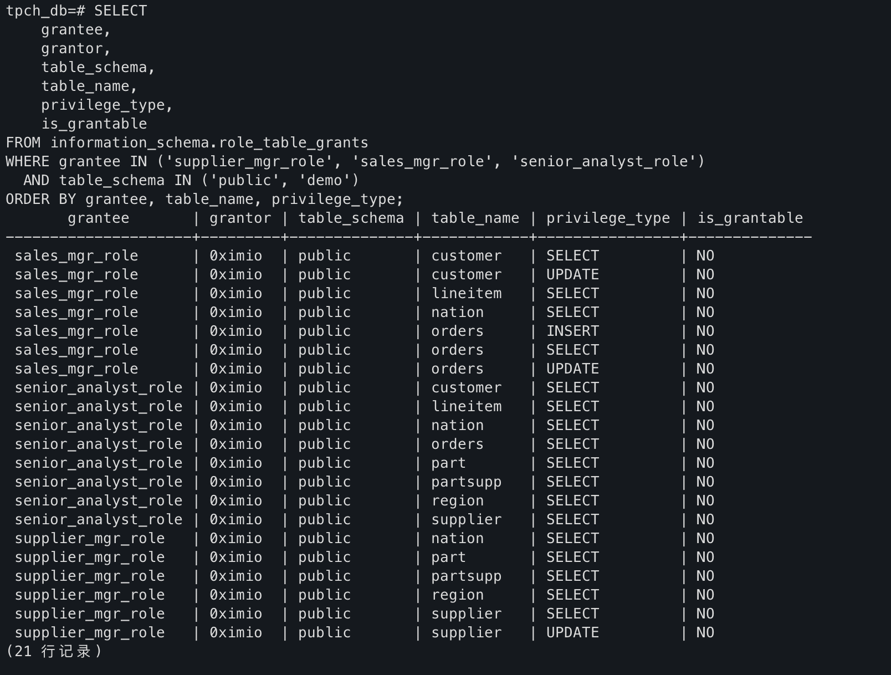


### 2.2 触发器实验

> 这里需要说明，由于postgresql的特性问题，必须要用函数引用来写触发器。因此触发器主体其实比较简单，并专注于把函数写对就可以了。
>
> 代码在`sql/triggers.sql`

#### 2.2.1 UPDATE 触发器


##### 1. **订单明细更新触发器**  

在 `lineitem` 表上创建 `UPDATE` 触发器：当 `l_extendedprice` 或 `l_discount` 被修改时，自动同步更新 `orders` 表中的 `o_totalprice`。

由于每有一行变化都需要使用触发器更改orders表，因此我们用行级触发器，主体如下：

``` sql
CREATE TRIGGER lineitem_update_totalprice
AFTER UPDATE OF l_extendedprice, l_discount ON lineitem
FOR EACH ROW
EXECUTE FUNCTION public.trg_lineitem_after_update();
```

然后写更新函数即，先计算出原来的价格和更新后的价格，然后直接更改`o_totalprice`就行了。

``` sql
CREATE OR REPLACE FUNCTION public.trg_lineitem_after_update()
RETURNS TRIGGER
LANGUAGE plpgsql
AS $$
DECLARE
    old_amount NUMERIC := COALESCE(OLD.l_extendedprice, 0) * (1 - COALESCE(OLD.l_discount, 0));
    new_amount NUMERIC := COALESCE(NEW.l_extendedprice, 0) * (1 - COALESCE(NEW.l_discount, 0));
BEGIN
    UPDATE orders
    SET o_totalprice = COALESCE(o_totalprice, 0) + (new_amount - old_amount)
    WHERE o_orderkey = NEW.l_orderkey;

    -- 把更新后的这行数据继续写入表
    RETURN NEW;
END;
$$;
```

##### 验证

我们需要先求一下改变值，假设改变了0.05的discount

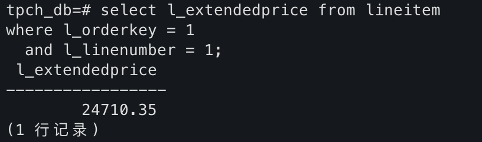

应该改变的`o_total_price`应该是`24710.35*0.05=1235.5175`（舍入为1235.52）

先把订单 o_orderkey = 1 的当前总价存到临时表 tmp_order_total_before，方便后面对比。

``` sql
SELECT o_totalprice AS total_before
INTO TEMP TABLE tmp_order_total_before
FROM orders
WHERE o_orderkey = 1;
```

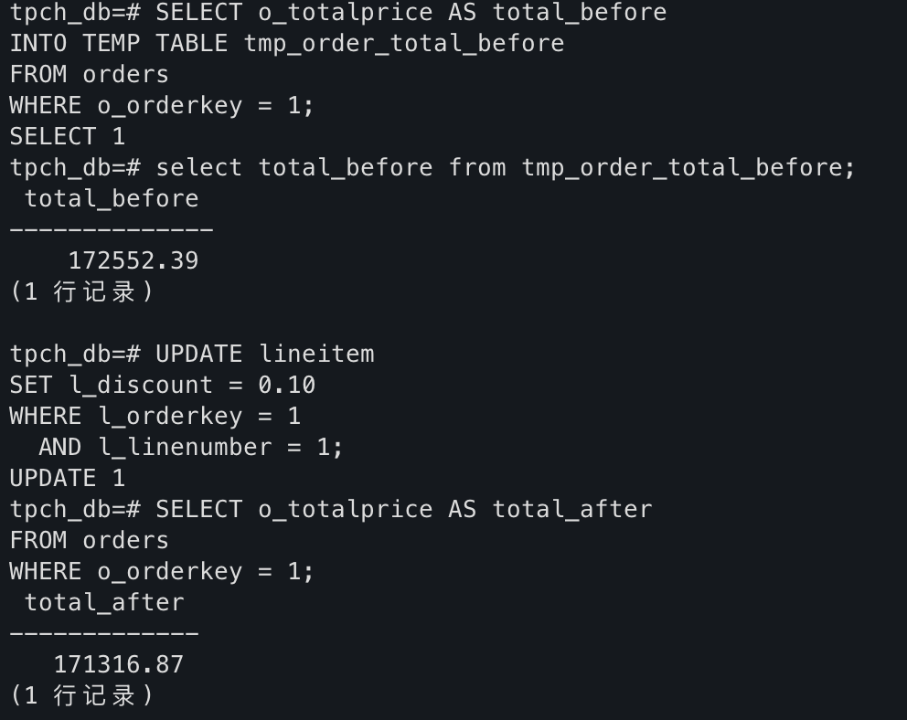

这里正好为`172552.39-171316.87=1235.52`，验证通过。


#### 2.2.2 INSERT 触发器

##### 2. **订单明细新增触发器**  

在 `lineitem` 表上创建 `INSERT` 触发器：当新增订单明细时，自动更新对应订单的 `o_totalprice`。假设新增明细对应的订单已存在。

同样的道理，这里也是一个行级触发器

``` sql
CREATE TRIGGER lineitem_insert_totalprice
AFTER INSERT ON lineitem
FOR EACH ROW
EXECUTE FUNCTION public.trg_lineitem_after_insert();
```

主体为把新订单价格加到`lineitem`表中的`o_totalprice`即可。

``` sql
CREATE OR REPLACE FUNCTION public.trg_lineitem_after_insert()
RETURNS TRIGGER
LANGUAGE plpgsql
AS $$
DECLARE
    new_amount NUMERIC := COALESCE(NEW.l_extendedprice, 0) * (1 - COALESCE(NEW.l_discount, 0));
BEGIN
    UPDATE orders
    SET o_totalprice = COALESCE(o_totalprice, 0) + new_amount
    WHERE o_orderkey = NEW.l_orderkey;
    RETURN NEW;
END;
$$;
```

##### 验证

插入一条记录，只需要关注`l_extendedprice`

``` sql
BEGIN;

SELECT o_totalprice
INTO TEMP TABLE tmp_order_total_insert
FROM orders
WHERE o_orderkey = 2;

INSERT INTO lineitem (
    l_orderkey, l_partkey, l_suppkey, l_linenumber,
    l_quantity, l_extendedprice, l_discount, l_tax,
    l_returnflag, l_linestatus, l_shipdate, l_commitdate,
    l_receiptdate, l_shipinstruct, l_shipmode, l_comment
)
VALUES (
    2,
    (SELECT p_partkey FROM part LIMIT 1),
    (SELECT s_suppkey FROM supplier LIMIT 1),
    999,        -- 确保不与现有行冲突
    1,
    123.45,
    0.05,
    0,
    'N',
    'O',
    CURRENT_DATE,
    CURRENT_DATE,
    CURRENT_DATE,
    'DELIVER IN PERSON',
    'AIR',
    'lab4 trigger test'
);
```

然后ROLLBACK之后再查询对应的`o_totalprice`计算一下。

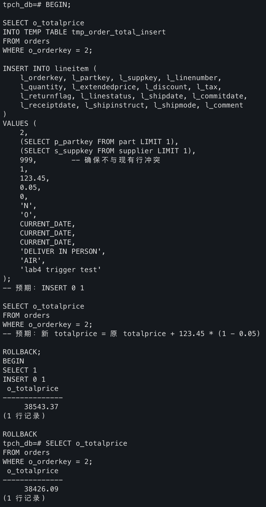

`新 totalprice = 原 totalprice + 123.45 * (1 - 0.05)`，即 `38426.09+117.2775（舍入为117.28）= 38543.37`，等式成立，验证成功。

## 3. 实验总结

本次实验在 TPCH 数据集上对权限控制与触发器进行操作。安全性部分通过多场景授权/回收实操，熟悉了角色设计、链式授权以及 `WITH GRANT OPTION` 带来的影响，并借助信息视图追踪授权链；触发器部分围绕订单，练习了基于 `OLD/NEW` 的行级逻辑编写与验证。

整体来看，实验帮助我加深了对数据库安全策略和数据一致性机制的理解。