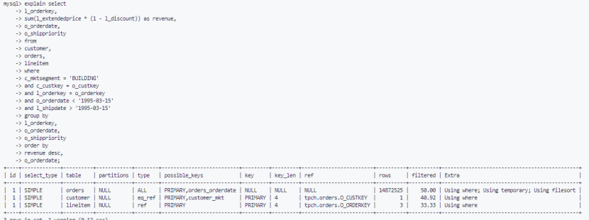
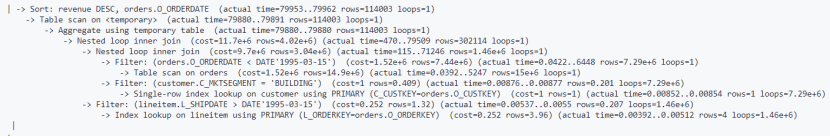

# 实验六 数据库查询性能调优实验

## 一、实验目的
1. 熟悉TPC-H的模式和查询，能够使用TPC-H工具生成数据和查询，了解基准测试流程。
2. 了解并学会使用EXPLAIN等工具分析查询执行计划，掌握查询优化的基本方法和原理，能够通过重写查询，建立索引等方法来优化查询性能。
3. 熟悉数据库系统中对查询性能起关键影响作用的参数配置，学会通过调整合适的配置参数来优化查询性能。
4. 理解不同方法对数据库查询性能的影响，并能够同时使用多种方法来进行性能调优，培养数据库性能分析和查询优化的能力。

## 二、实验数据集
本次实验使用TPC-H数据集，生成了至少10 GB的数据，更多细节在`define.md`中。
生成的 TPC-H 22条查询在当前目录queries文件夹下，为d1.sql到d22.sql。
我已经完成数据导入，包含 TPC-H 完整的8张表（`part`、`region`、`nation`、`customer`、`supplier`、`orders`、`partsupp`和`lineitem`）以及对应数据量的数据。且在数据导入之后，能够在数据库上正常执行 TPC-H 的查询。


## 三、实验内容和要求
### 注意事项：
实验报告，包括采用的提升查询性能的措施和对应的结果，优化过程中需说明选择的优化方法及原因。如有额外创新优化方法，可在实验报告中详细描述。

### 实验内容：

#### 任务1：使用DBMS工具分析查询性能瓶颈
通过执行计划工具深入了解查询性能瓶颈。学会使用 `EXPLAIN` 和 `EXPLAIN ANALYZE` 对指定的 TPC-H 查询进行分析。查看输出的查询的执行计划，包括扫描的行数、索引使用情况和查询代价等，然后分析是否存在全表扫描、未使用索引、排序或临时表等操作。

**要求：** 需完成至少 2 条 TPC-H 查询的执行计划分析，可以在 Q4 Q5 Q9 Q11 Q17 Q19中选择进行分析。

**提示：** 可以参考`TPC-H 22条Query简述.md`大致熟悉查询，参考下面的网址熟悉EXPLAIN的用法和解释：
* [https://dev.mysql.com/doc/refman/8.0/en/explain-output.html](https://dev.mysql.com/doc/refman/8.0/en/explain-output.html)
* [https://blog.csdn.net/weixin_41558728/article/details/81704916](https://blog.csdn.net/weixin_41558728/article/details/81704916)
再选择具体的query进行分析。

**示例：** 对TPC-H Q3 进行 EXPLAIN和EXPLAIN ANALYZE，分别得到如下结果：




**给出你的分析：**
1. 通过对查询的观察以及对查询计划的分析，你需要能简单描述一下这个查询，可以用自然语言或者符号语言简单描述该查询的整体过程，后面分析连接算子、过滤算子、聚合算子具体做了什么。
2. 根据EXPLAIN和EXPLAIN ANALYZE 来分析查询性能瓶颈，例如分析有无子查询或者联合查询，是否全表扫描等。
3. 给出你的优化建议，并在后面的查询优化任务中验证你的方法。

#### 任务2：使用查询优化技术提升查询性能
使用查询优化方法来降低查询执行的延迟，包括重写查询、创建索引等方法，并记录优化前后的执行时延，计算每条查询优化后性能提升程度和延迟降低程度。

**要求：**
1. 至少选择 2 条查询（在 Q4 Q5 Q9 Q11 Q17 Q19中选择）进行查询优化。
2. 对优化前后查询的延迟进行记录和对比，为避免偶然性至少需要运行3次查询，平均查询延迟降低百分比达到40%。
3. 实验报告及验收中需要提交查询优化前后的SQL以及对应的执行时间截图。

**提示：** 可以参考当前目录下`optimize.md`、网上技术博客来优化查询。
**查询延迟降低百分比：** `（（原延迟 - 优化后延迟) / 原延迟 ） * 100%`

#### 任务3：调整数据库参数配置提升查询性能
OLAP负载通常包含复杂的查询，例如多表 JOIN、排序和聚合操作，这些查询对系统的 I/O 和内存资源要求较高。可以通过调整数据库系统的核心参数配置，来最大化内存 and 缓存的利用率，从而显著提升查询性能，减少查询延迟。

**要求：**
1. 能够通过修改数据库的参数配置文件或者手动直接修改来调整参数，如：缓冲池大小、Join(sort)缓冲区大小、IO线程数等。
2. 选择 2 条典型的查询（在 Q4 Q5 Q9 Q11 Q17 Q19中选择），使用参数调优方法来降低该查询执行的延迟，与原始查询执行（未做任何优化）相比，查询处理延迟降低百分比至少30%，并分析原因。在实验报告和验收中需要提供详细的参数配置情况。

**提示：** 可能能够提升查询性能的PostgreSQL的参数配置（修改配置文件）
```ini
# -----------------------------------------------
# PostgreSQL内存设置
# -----------------------------------------------
innodb_buffer_pool_size=?            # 尽量使用内存缓存数据，占系统内存的 50%-75%
innodb_buffer_pool_instances=?       # 缓冲池实例个数
tmp_table_size=?                     # 临时表内存
join_buffer_size=?                   # JOIN BUFFER
sort_buffer_size=?                   # SORT BUFFER
```
3. 更改参数配置后，利用提供的脚本 `tpch-benchmark-olap.py` 测试更改前后整体22条查询的总延迟，并计算相关指标。

#### 任务4：多种方法结合提升查询性能
多种优化技术（如查询优化、参数配置调整等）往往是正交可以叠加的。

**要求：**
1. 至少同时使用查询优化和数据库参数配置调整这两种优化方法，选择 1 条典型的查询，如Q2、Q9、Q19等，观察叠加使用优化方法后的效果，并计算延迟降低的程度分析其原因。

**提示：** 可以列出单独使用以及叠加使用优化方法的延迟，如：
* TPC-H Q9在默认配置下latency为：16 min 24.61 sec
* 仅查询优化后latency为：2 min 31.30 sec
* 仅优化参数配置后latency for：3 min 59.11 sec
* 同时优化参数配置和查询执行计划之后latency为：23.77 sec

## 四、实验报告
**实验报告**

* **题目：**
* **姓名：**
* **学号：**
* **实验环境：**（计算机配置，操作系统，DBMS版本等）
* **实验步骤：**（分析查询瓶颈，查询优化方式）
* **实验结果及分析：**（给出查询优化前后查询执行时间的对比图，分析能够降低时延原因）
* **实验总结：**